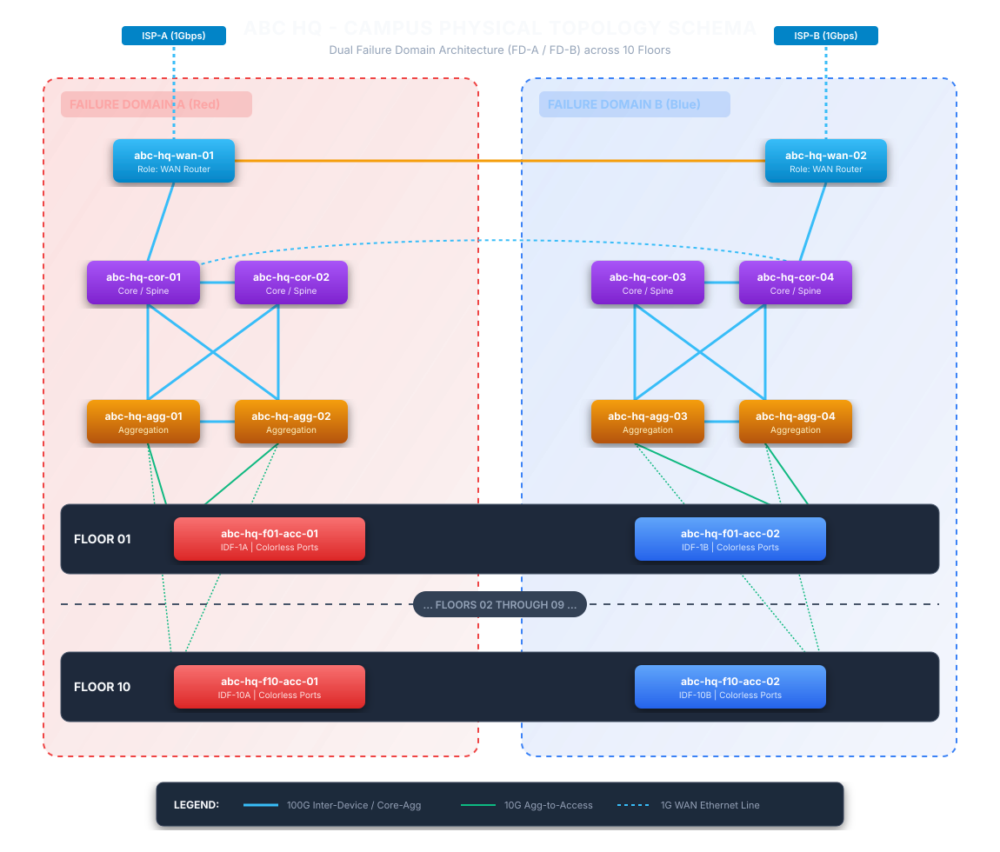

# Automation Native Campus Network Design

This is a sample network design to demonstrate how an automation native network design should look like. Automation native is a design approach which incorporates the elements required by network automation into design process. These elements are: Determinsitic Topology, Abstraction, Machine-Friendly interfaces & structured data, Unique source of truth, Declarative state and Streaming Telemetry.

## Business Requirement

Company ABC is setting up a new 2,000 user campus across a 10-floor building. At this scale, the business needs the network to onboard new starters, moves, and floor-capacity changes quickly without service risk; to keep voice, data, wireless, and fixed-function devices like cameras and IPTV appropriately segmented so a change in one domain can't degrade or expose another. The business also wants these changes itself to be fast, low-risk, and auditable — every BAU change traceable to a reviewed, versioned intent rather than an ad hoc CLI session.

The business requirements can be summarized as:
1. Onboard starters, moves, and floor-capacity changes quickly, without service risk
2. Segment voice/data/wireless/camera/IPTV so one domain can't degrade or expose another
3. BAU Change is fast, low-risk, and auditable

## Technical Requirement

| Business Requirements | Technical Requirements | 
|---|---|
| Onboard starters, moves, and floor-capacity changes quickly, without service risk | ​- A layer 3 Routed Access EVPN-VXLAN Fabric as underlay where Layer 2 / 3 services can be running on top <br> - ​Zero-Trust Access Ports (Identity-Driven Access) |
| Segment voice/data/wireless/camera/IPTV so one domain can't degrade or expose another | - ​Macro-Segmentation (VRF Isolation) to separate differnt business nature of devices into different tenants <br> - ​Micro-Segmentation & QoS Policies to restrict communication between devices within the same tenant |
| BAU Change is fast, low-risk, and auditable | ​- Single Source of Truth (SSoT) & Infrastructure-as-Code (IaC) <br> - ​CI/CD Pipeline with Automated Validation <br> - ​Streaming Telemetry & Closed-Loop Auditing |

## Design

### Data models 

<details>
<summary>Physical Topology</summary>

```yaml
---
site_physical_topology:
  site_code: "abc-hq"
  site_name: "Company ABC Main Campus"
  building: "Main Building (10 Floors)"

  # ============================================================================
  # 1. FAILURE DOMAIN DEFINITIONS
  # ============================================================================
  failure_domains:
    - domain_id: "FD-A"
      description: "Primary Redundancy Plane (Red Domain)"
      rack_group: "Suite-A / Left-IDF"
    - domain_id: "FD-B"
      description: "Secondary Redundancy Plane (Blue Domain)"
      rack_group: "Suite-B / Right-IDF"

  # ============================================================================
  # 2. GLOBAL LINK SPEED STANDARDS
  # ============================================================================
  link_standards:
    wan_circuit:
      speed: "1Gbps"
      media: "1000BASE-T_Ethernet"
    inter_device: # Same-layer horizontal links (WAN-to-WAN, Core-to-Core, Agg-to-Agg)
      speed: "100Gbps"
      media: "100GBASE-SR4_Fiber"
    core_to_agg:
      speed: "100Gbps"
      media: "100GBASE-SR4_Fiber"
    agg_to_access:
      speed: "10Gbps"
      media: "10GBASE-SR_Fiber"

  # ============================================================================
  # 3. DEVICE INVENTORY & PHYSICAL INTERCONNECTS
  # ============================================================================

  # --- WAN LAYER ---
  wan_routers:
    - name: "abc-hq-wan-01"
      failure_domain: "FD-A"
      external_links:
        - interface: "GigabitEthernet0/0/0"
          type: "wan_circuit"
          description: "ISP-A Primary 1Gbps Ethernet Line"
      internal_links:
        - local_port: "HundredGigE0/1/0"
          remote_device: "abc-hq-wan-02"       # Link between same-type devices (FD-A to FD-B)
          remote_port: "HundredGigE0/1/0"
          type: "inter_device"
        - local_port: "HundredGigE0/2/0"
          remote_device: "abc-hq-cor-01"
          remote_port: "HundredGigE0/0/1"
          type: "inter_device"

    - name: "abc-hq-wan-02"
      failure_domain: "FD-B"
      external_links:
        - interface: "GigabitEthernet0/0/0"
          type: "wan_circuit"
          description: "ISP-B Backup 1Gbps Ethernet Line"
      internal_links:
        - local_port: "HundredGigE0/1/0"
          remote_device: "abc-hq-wan-01"
          remote_port: "HundredGigE0/1/0"
          type: "inter_device"
        - local_port: "HundredGigE0/2/0"
          remote_device: "abc-hq-cor-03"
          remote_port: "HundredGigE0/0/1"
          type: "inter_device"

  # --- CORE LAYER ---
  core_routers:
    # Failure Domain A Core Pair
    - name: "abc-hq-cor-01"
      failure_domain: "FD-A"
      links:
        - local_port: "HundredGigE0/0/2"
          remote_device: "abc-hq-cor-02"       # Core-to-Core (Same FD)
          remote_port: "HundredGigE0/0/2"
          type: "inter_device"
        - local_port: "HundredGigE0/0/3"
          remote_device: "abc-hq-cor-03"       # Core-to-Core (Cross FD)
          remote_port: "HundredGigE0/0/3"
          type: "inter_device"
        - local_port: "HundredGigE1/0/1"
          remote_device: "abc-hq-agg-01"       # Core-to-Agg
          remote_port: "HundredGigE0/1"
          type: "core_to_agg"
        - local_port: "HundredGigE1/0/2"
          remote_device: "abc-hq-agg-02"       # Core-to-Agg
          remote_port: "HundredGigE0/1"
          type: "core_to_agg"

    - name: "abc-hq-cor-02"
      failure_domain: "FD-A"
      links:
        - local_port: "HundredGigE0/0/2"
          remote_device: "abc-hq-cor-01"
          remote_port: "HundredGigE0/0/2"
          type: "inter_device"
        - local_port: "HundredGigE1/0/1"
          remote_device: "abc-hq-agg-01"
          remote_port: "HundredGigE0/2"
          type: "core_to_agg"
        - local_port: "HundredGigE1/0/2"
          remote_device: "abc-hq-agg-02"
          remote_port: "HundredGigE0/2"
          type: "core_to_agg"

    # [ Devices abc-hq-cor-03 and 04 follow the same pattern in FD-B ]

  # --- AGGREGATION LAYER ---
  aggregation_switches:
    - name: "abc-hq-agg-01"
      failure_domain: "FD-A"
      links:
        - local_port: "HundredGigE0/48"
          remote_device: "abc-hq-agg-02"       # Agg-to-Agg (Same FD)
          remote_port: "HundredGigE0/48"
          type: "inter_device"

    - name: "abc-hq-agg-03"
      failure_domain: "FD-B"
      links:
        - local_port: "HundredGigE0/48"
          remote_device: "abc-hq-agg-04"       # Agg-to-Agg (Same FD)
          remote_port: "HundredGigE0/48"
          type: "inter_device"

  # --- ACCESS LAYER GENERATOR (Floors 1-10) ---
  floors:
    - floor_number: 1
      access_switches:
        - name: "abc-hq-f01-acc-01"
          failure_domain: "FD-A"
          uplinks:
            - local_port: "TenGigabitEthernet1/1/1"
              remote_device: "abc-hq-agg-01"
              remote_port: "TenGigabitEthernet1/0/1"
              type: "agg_to_access"
            - local_port: "TenGigabitEthernet1/1/2"
              remote_device: "abc-hq-agg-02"
              remote_port: "TenGigabitEthernet1/0/1"
              type: "agg_to_access"

        - name: "abc-hq-f01-acc-02"
          failure_domain: "FD-B"
          uplinks:
            - local_port: "TenGigabitEthernet1/1/1"
              remote_device: "abc-hq-agg-03"
              remote_port: "TenGigabitEthernet1/0/1"
              type: "agg_to_access"
            - local_port: "TenGigabitEthernet1/1/2"
              remote_device: "abc-hq-agg-04"
              remote_port: "TenGigabitEthernet1/0/1"
              type: "agg_to_access"

    # [ Floors 2 to 10 follow the identical pattern for acc-01 and acc-02 ]
```
</details>




