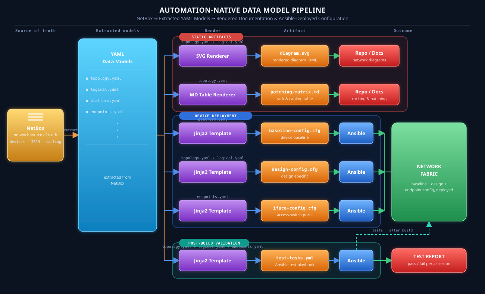
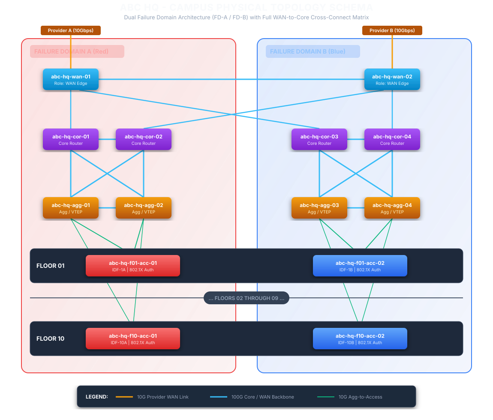
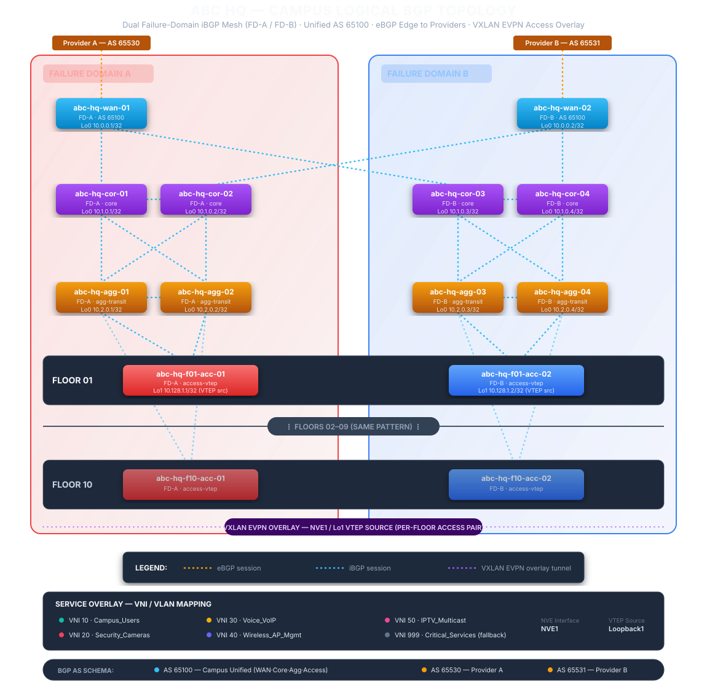

# Automation Native Network Design Explain

This is a sample network design to demonstrate how an automation native network design should look like. Automation native is a design approach which incorporates the elements required by network automation into design process. These elements are: Determinsitic Topology, Abstraction, Machine-Friendly interfaces & structured data, Unique source of truth, Declarative state and Streaming Telemetry.

Key takeaways:
- Data model first, every content is generated from data models written in yaml
- In this example, data model has already included the values. In real world, this is further broken down to a JSON schema (data model without value). Use Netbox to marry the schema and value together becoming the data model we see here.
- Generated contents includes diagram, racking and stacking plan, cable patching matrix, device baseline configurations and design specific configurations, automated test plan
- Diagram -> Render from data model to svg format (xml)
- Racking and cable patching matrix -> Render from physical data model to table (md)
- Device baseline configuration -> Render from platform data model, Network source of truth, platform specific Jinj2 template, deploy using Ansible
- Design specific configuration -> Render from physical topology data model, logical data model, deploy using Ansible
- Access Switch endpoint facing interface configuration -> Render from the end-point service data model, deploy using Ansible
- The deployment from the initial stage for SoT to end state of config deployed can be managed as workflow using workflow engine to join tie the task together. There will be 2 workflows: one for the build and another for the endpoint services provisioning/deprovisioning.

<div style="display: flex; gap: 20px;">
  <div style="flex: 1;">
    <h3>Automation Native Design Approach</h3>
  </div>

  <div style="flex: 1;">
    
  </div>
</div>

---

# Campus Network Design

## Business Requirement

Company ABC is setting up a new 2,000 user campus across a 10-floor building. At this scale, the business needs the network to onboard new starters, moves, and floor-capacity changes quickly without service risk; to keep voice, data, wireless, and fixed-function devices like cameras and IPTV appropriately segmented so a change in one domain can't degrade or expose another. The business also wants these changes itself to be fast, low-risk, and auditable — every BAU change traceable to a reviewed, versioned intent rather than an ad hoc CLI session.

The business requirements can be summarized as:
1. Onboard starters, moves, and floor-capacity changes quickly, without service risk
2. Segment voice/data/wireless/camera/IPTV so one domain can't degrade or expose another
3. BAU Change is fast, low-risk, and auditable

## Technical Requirement

| Business Requirements | Technical Requirements | 
|---|---|
| Onboard starters, moves, and floor-capacity changes quickly, without service risk | ​- A layer 3 Routed Access EVPN-VXLAN Fabric as underlay where Layer 2 / 3 services can be running on top <br> - ​Zero-Trust Access Ports (Identity-Driven Access) |
| Segment voice/data/wireless/camera/IPTV so one domain can't degrade or expose another | - ​Macro-Segmentation (VRF Isolation) to separate differnt business nature of devices into different tenants <br> - ​Micro-Segmentation & QoS Policies to restrict communication between devices within the same tenant |
| BAU Change is fast, low-risk, and auditable | ​- Single Source of Truth (SSoT) & Infrastructure-as-Code (IaC) <br> - ​CI/CD Pipeline with Automated Validation <br> - ​Streaming Telemetry & Closed-Loop Auditing |

## Scope

For the sake of demonstration, the implementation details of management and WIFI network are not covered.

## Network Design

This section outlines the architectural framework and design principles for the campus network:

### Topology & Connectivity Hierarchy

* Implements a standard five-tier architecture: Regional On-Prem/Cloud Colo Access $\rightarrow$ WAN $\rightarrow$ Core $\rightarrow$ Aggregation $\rightarrow$ Access.
* Extends dual-homed connections across all network tiers for end-to-end path redundancy.




### Control Plane & Overlay Architecture

* Deploys a unified BGP Routing-based transport underlay.
* Runs EVPN-VXLAN on top of the underlay to deliver flexible Layer 2/Layer 3 multi-tenant virtual overlay networks.



### Network Services & Security

* Mandates 802.1X Network Access Control (NAC) across all Access switch endpoint interfaces.
* Centralizes RADIUS authentication and authorization services within the hub data center.

### Platform Standardization

* WAN Tier: Standardized on a dedicated WAN routing platform optimized for edge peering and WAN features.
* Core & Aggregation Tiers: Standardized on a single, high-throughput campus fabric switching platform.
* Access Tier: Standardized on a dedicated edge-switching platform designed for high-density endpoint connectivity and 802.1X enforcement.

### Resiliency & Fault Isolation

* Enforces complete two-way physical and logical diversity across all infrastructure components (dual WAN routers, dual ISP/colo circuits).
* Extends two-way isolation into dedicated dual failure domains (FD-A and FD-B) spanning the Core, Aggregation, and Access layers.

### Bandwidth & Interface Capacity

* Endpoint Ports: Supports 1Gbps or 10Gbps access connectivity per endpoint interface.
* Inter-Device Trunking: All internal backbone, Core, Aggregation, and inter-plane links operate at 100Gbps.
* WAN Edge Uplinks: Dual 10Gbps dedicated circuits connecting the campus WAN edge to regional on-prem data centers and cloud colocation facilities.

## Data Models

This design is constructed from a set of data models which provides a structure for the "source of truth" information that the automation tools will need. The models are used to render, validate, deploy and maintainthe configurations over automated workflows.

### Design Driven Models

Design driven models define the physical and logical network topology. Endpoint Service has been taken out as a separate data model since it will be frequently reused in BAU.

Every data model below also has a generated JSON Schema under
[`schemas/`](schemas/) -- draft 2020-12, structurally inferred from the
YAML itself (required vs. optional fields, closed vocabularies like link
types and CoPP priority tiers, IPv4/CIDR string patterns) by
[`scripts/generate_schemas.py`](scripts/generate_schemas.py). Regenerate
with `python3 scripts/generate_schemas.py .` after any model change --
every generated schema was checked to both be a valid 2020-12 schema and
to accept its own source YAML without error before being committed here.

| Data Model | Purpose | JSON Schema |
|---|---|---|
| [Physical Topology - Campus Network](models/physical%20topology.yaml) | Ground-truth inventory of campus network hardware and cabling — devices, ports, and interconnects. | [physical-topology.schema.json](schemas/physical-topology.schema.json) |
| [Physical Topology - Management Network](models/physical%20topology%20management%20network.yaml) | Ground-truth inventory of the OOB management network — terminal servers, management switches, and console cabling. | [physical-topology-management-network.schema.json](schemas/physical-topology-management-network.schema.json) |
| [Logical Topology](models/logical%20topology.yaml) | Defines the campus's BGP underlay and VXLAN EVPN overlay — how traffic is forwarded and isolated, independent of physical hardware. | [logical-topology.schema.json](schemas/logical-topology.schema.json) |
| [Endpoint Service](models/endpoint%20service.yaml) | Standardized security and QoS baseline for endpoint switchports — loop protection, 802.1X/MAB, FHS, and edge QoS | [endpoint-service.schema.json](schemas/endpoint-service.schema.json) |

### Device Role Models

Device role model define a standardized, platform-agnostic set of foundational hardening, security, and operational features that must be implemented on every network device. This model will be used in conjunction with a platform specific jinja2 template to render the configuration output required by the platform acting as that role.

| Data Model | Platform Template| JSON Schema |
|---|---|---|
| [WAN Edge Role](models/wan%20edge%20role.yaml) | [Catalyst 8000](templates/catalyst%208000.j2) | [wan-edge-role.schema.json](schemas/wan-edge-role.schema.json) |
| [Core & Agg Role](models/core%20agg%20role.yaml) | [Nexus 93240](templates/nexus%2093240.j2) | [core-agg-role.schema.json](schemas/core-agg-role.schema.json) |
| [Access Role](models/access%20role.yaml) | [Catalyst 9000](templates/catalyst%2090000.j2) | [access-role.schema.json](schemas/access-role.schema.json) |

## Design Deployment

### Step 1. Baseline Build

Prerequisite:
- Management Network has been up and running so that devices are reachable by Ansible runners
- Devices are physically racked and patched according to the patching scheme

Build workflow:
Apply the baseline template for each device -> Validate device local configuration -> Apply physical topology template -> Run point-to-point connectivity validation between devices -> Apply logical topology template -> Run layer 3 connectivity validation, endpoint vlan validation

## Validation

Two independent layers, checking two different things -- neither one
substitutes for the other:

1. **Render-vs-data-model validation (static, pre-deployment)** --
   [`scripts/validate_configs.py`](scripts/validate_configs.py) checks that
   what actually came out of the templates (`rendered_configs/<hostname>.cfg`)
   agrees with what `physical_topology.yaml` / `logical_topology.yaml` /
   `endpoint service.yaml` / the platform role baseline say it should be:
   every hostname, physical interface + description, loopback/logical IP,
   BGP process and neighbor line, NTP/SNMP/syslog/TACACS+ line, CoPP
   ACL/class-map, EVPN VLAN/VNI/SVI, and (access switches only) every
   endpoint switchport's VLAN/voice-VLAN/port-security/dot1x-mab/
   storm-control line the data model calls for. It reuses the exact same lookup functions the templates
   call (`device_phys_links`, `device_routing_record`, `wan_peer_binding`,
   `ios_addr`, ...) rather than re-deriving expected values independently,
   so a failure means the template/filter combination itself has a genuine
   defect, not that this script disagrees with the templates for its own
   reasons. This is a regression test for the *build tooling* -- it runs
   before anything ever touches a device, and it does not require any
   device, credential, or Ansible collection to run. Runnable either
   directly (`python3 scripts/validate_configs.py .`) or, preferably, via
   [`playbooks/00_validate_render.yml`](playbooks/00_validate_render.yml)
   (see [Ansible Playbooks](#ansible-playbooks)), which re-renders every
   device, runs the same script, surfaces every individual check as its
   own Ansible task result (`-e validate_verbose=true` to print all of
   them), writes a full per-check `rendered_configs/validation_report.md`,
   and -- unlike running the script by hand -- fails the play (and so
   `site.yml`, which runs it first) if anything doesn't match, so a
   template/filter regression can't reach stage 01's device push at all.
2. **Live-device validation (post-deployment)** -- embedded directly in the
   Ansible playbooks (see [Ansible Playbooks](#ansible-playbooks)):
   facts-gathering after the baseline push, an LLDP neighbor-count check
   against `physical_topology.yaml` after the physical topology push, and a
   BGP-neighbor / endpoint-VLAN presence check against `logical_topology.yaml`
   after the logical topology push. Separately (and independently of the
   00-03 build sequence), `playbooks/bau_endpoint_provisioning.yml` checks
   `show interfaces status` for the VLAN each port it just pushed should now
   show. This is the check that the *device* actually came up the way the
   rendered config said it would.

See [Validation Reports](#validation-reports) for the current
`validate_configs.py` run, and `rendered_configs/validation_report.md`
(generated by `playbooks/00_validate_render.yml`) for the full per-check
detail behind it.

### Data Models (Value ingested)

All 12 devices' rendered configuration (baseline + physical topology + logical topology, chained per design.md's Step 1 build workflow) are under [`rendered_configs/`](rendered_configs/) -- one `<hostname>.cfg` file per device: abc-hq-wan-01/02, abc-hq-cor-01..04, abc-hq-agg-01..04, abc-hq-f01-acc-01/02. Generated by [`scripts/render_configs.py`](scripts/render_configs.py), which chains each device's platform baseline template with [physical topology.j2](templates/physical%20topology.j2) and [logical topology.j2](templates/logical%20topology.j2) using the lookup filters in [`filter_plugins/netascode_filters.py`](filter_plugins/netascode_filters.py). Building these two templates originally surfaced three data-model addressing defects (Core↔Aggregation underlay /31 mismatches, a reused /31 subnet, and an access-uplink interface-name mismatch) -- all three have since been corrected directly in `models/logical topology.yaml`; see [Config Output](#config-output) below for what changed and the [Campus Operational Topology Diagram](./diagram/operational.svg) for the corrected as-rendered result. Every platform role baseline's syslog and TACACS+ blocks, previously empty (`servers: []`), now carry demo server IPs/keys (see each `models/*role.yaml` file's inline `# DEMO value` comments) so those sections actually render instead of falling back to their `! NOTE: no ... servers defined` placeholders. abc-hq-f01-acc-01/02 additionally carry a 4th render stage -- [endpoint service.j2](templates/endpoint%20service.j2) against [`models/endpoint service.yaml`](models/endpoint%20service.yaml) -- the same BAU switchport template [`playbooks/bau_endpoint_provisioning.yml`](playbooks/bau_endpoint_provisioning.yml) re-runs on its own for a real endpoint change; see [Ansible Playbooks](#ansible-playbooks) for why that playbook is kept separate from `site.yml`.

### Validation Reports

`scripts/validate_configs.py` output against the current
`rendered_configs/` (run with `python3 scripts/validate_configs.py .` from
the repo root):

```code
DEVICE                PASS  FAIL  SKIP*
----------------------------------------
abc-hq-wan-01           35     0      1
abc-hq-wan-02           35     0      1
abc-hq-cor-01           43     0      0
abc-hq-cor-02           43     0      0
abc-hq-cor-03           43     0      0
abc-hq-cor-04           43     0      0
abc-hq-agg-01           43     0      0
abc-hq-agg-02           43     0      0
abc-hq-agg-03           43     0      0
abc-hq-agg-04           43     0      0
abc-hq-f01-acc-01      335     0      0
abc-hq-f01-acc-02      335     0      0
----------------------------------------
TOTAL                 1084     0      2
(*SKIP = known, already-documented data-model gap -- not a render defect)

PASS: 1084 checks passed, 0 failed, 2 known-gap skips, across 12 devices
```

SKIP (2, one per WAN router) is FINDING 1 from
[logical topology.j2](templates/logical%20topology.j2)'s own header: a WAN
router's eBGP peer has no IP this repo's data model can derive (the
neighbor IP itself is known from `logical_topology.yaml`, but *which local
interface/IP* it rides on isn't stated anywhere and isn't guessable) -- the
check is intentionally skipped rather than failed, since failing it would
just be re-reporting a data-model gap this doc already documents elsewhere,
not a new render defect.

This validator was itself checked for false positives before being trusted:
a copy of `rendered_configs/abc-hq-cor-01.cfg` was deliberately corrupted
(hostname line truncated/altered, and separately a physical-interface
description swapped onto the wrong interface) and re-run -- both faults
were caught and reported by name/line, confirming the checks are scoped to
the right interface stanza and require an exact line match rather than a
loose substring-anywhere-in-the-file match (an earlier draft of this script
had exactly that bug: `"hostname abc-hq-cor-01" in cfg_text` still matched
a corrupted `hostname abc-hq-cor-01-TYPO` line, since the good string is a
substring of the bad one). The corrupted file was restored and re-verified
byte-identical to the original before this report was captured.

This same check now also runs as
[`playbooks/00_validate_render.yml`](playbooks/00_validate_render.yml) (see
[Ansible Playbooks](#ansible-playbooks)) -- `ansible-playbook
playbooks/00_validate_render.yml` re-renders every device, runs this
script, prints a summary task result giving the pass/fail/skip counts, and
writes the full per-check breakdown to
`rendered_configs/validation_report.md` (one Markdown table per device --
every category/expectation/result this script produced, not just the
summary). Add `-e validate_verbose=true` to also print each individual
check as its own Ansible task result while the play runs. Unlike invoking
the script directly, the playbook turns a failure into a hard gate: it's
the first play `site.yml` imports, and `import_playbook` aborts the whole
sequence if it fails, so a template/filter regression can never reach a
real device push. That gate was verified the same way as the checks above
-- temporarily breaking `templates/physical topology.j2`'s hostname line
reproduced a 12-failure run (one per device) and a non-zero
`ansible-playbook` exit code, confirming `site.yml` would stop before
`01_baseline_build.yml` ever ran; the template was then restored and
re-verified byte-identical, and a clean re-run confirmed 416/0/2 again.
