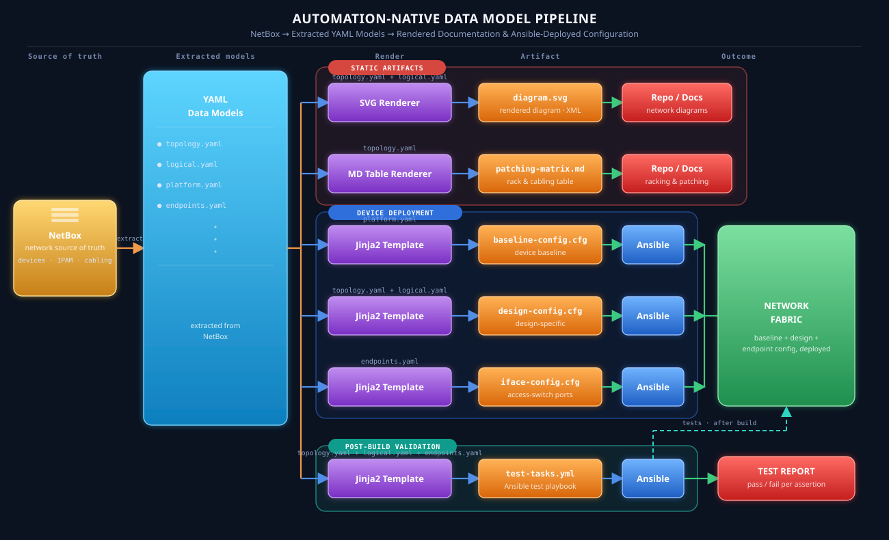
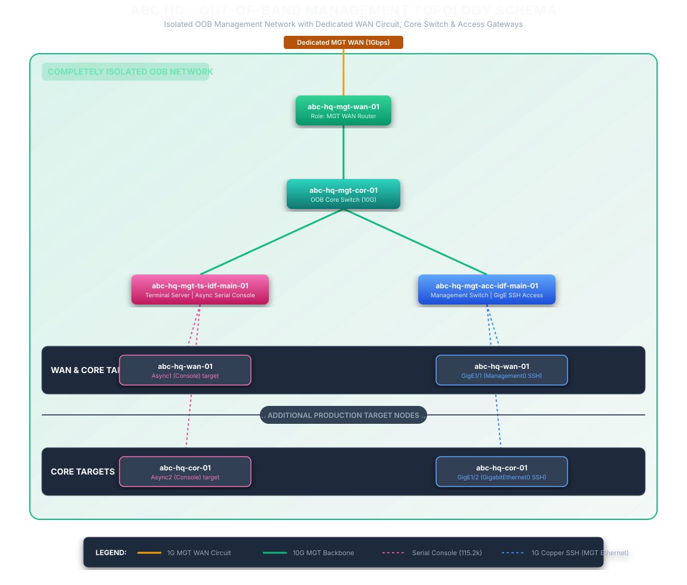
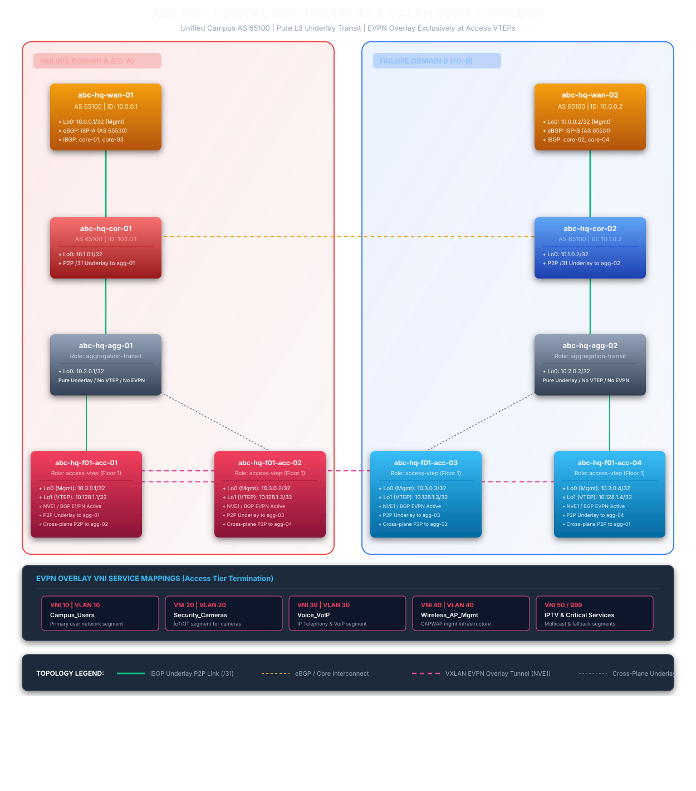

# Automation Native Network Design Explain

This is a sample network design to demonstrate how an automation native network design should look like. Automation native is a design approach which incorporates the elements required by network automation into design process. These elements are: Determinsitic Topology, Abstraction, Machine-Friendly interfaces & structured data, Unique source of truth, Declarative state and Streaming Telemetry.

Key takeaways:
- Data model first, every content is generated from data models written in yaml
- In this example, data model has already included the values. In real world, this is further broken down to a JSON schema (data model without value). Use Netbox to marry the schema and value together becoming the data model we see here.
- Generated contents includes diagram, racking and stacking plan, cable patching matrix, device baseline configurations and design specific configurations, automated test plan
- Diagram -> Render from data model to svg format (xml)
- Racking and cable patching matrix -> Render from physical data model to table (md)
- Device baseline configuration -> Render from platform data model, Network source of truth, platform specific Jinj2 template, deploy using Ansible
- Design specific configuration -> Render from physical topology data model, logical data model, deploy using Ansible
- Access Switch endpoint facing interface configuration -> Render from the end-point service data model, deploy using Ansible
- The deployment from the initial stage for SoT to end state of config deployed can be managed as workflow using workflow engine to join tie the task together. There will be 2 workflows: one for the build and another for the endpoint services provisioning/deprovisioning.

<div style="display: flex; gap: 20px;">
  <div style="flex: 1;">
    <h3>Automation Native Design Approach</h3>
  </div>

  <div style="flex: 1;">
    
  </div>
</div>

---

# Campus Network Design

## Business Requirement

Company ABC is setting up a new 2,000 user campus across a 10-floor building. At this scale, the business needs the network to onboard new starters, moves, and floor-capacity changes quickly without service risk; to keep voice, data, wireless, and fixed-function devices like cameras and IPTV appropriately segmented so a change in one domain can't degrade or expose another. The business also wants these changes itself to be fast, low-risk, and auditable — every BAU change traceable to a reviewed, versioned intent rather than an ad hoc CLI session.

The business requirements can be summarized as:
1. Onboard starters, moves, and floor-capacity changes quickly, without service risk
2. Segment voice/data/wireless/camera/IPTV so one domain can't degrade or expose another
3. BAU Change is fast, low-risk, and auditable

## Technical Requirement

| Business Requirements | Technical Requirements | 
|---|---|
| Onboard starters, moves, and floor-capacity changes quickly, without service risk | ​- A layer 3 Routed Access EVPN-VXLAN Fabric as underlay where Layer 2 / 3 services can be running on top <br> - ​Zero-Trust Access Ports (Identity-Driven Access) |
| Segment voice/data/wireless/camera/IPTV so one domain can't degrade or expose another | - ​Macro-Segmentation (VRF Isolation) to separate differnt business nature of devices into different tenants <br> - ​Micro-Segmentation & QoS Policies to restrict communication between devices within the same tenant |
| BAU Change is fast, low-risk, and auditable | ​- Single Source of Truth (SSoT) & Infrastructure-as-Code (IaC) <br> - ​CI/CD Pipeline with Automated Validation <br> - ​Streaming Telemetry & Closed-Loop Auditing |

## Scope

For the sake of demonstration, the implementation details of management and WIFI network are not covered.

## Network Design

This section outlines the architectural framework and design principles for the campus network:

### Topology & Connectivity Hierarchy

* Implements a standard five-tier architecture: Regional On-Prem/Cloud Colo Access $\rightarrow$ WAN $\rightarrow$ Core $\rightarrow$ Aggregation $\rightarrow$ Access.
* Extends dual-homed connections across all network tiers for end-to-end path redundancy.




### Control Plane & Overlay Architecture

* Deploys a unified BGP Routing-based transport underlay.
* Runs EVPN-VXLAN on top of the underlay to deliver flexible Layer 2/Layer 3 multi-tenant virtual overlay networks.



### Network Services & Security

* Mandates 802.1X Network Access Control (NAC) across all Access switch endpoint interfaces.
* Centralizes RADIUS authentication and authorization services within the hub data center.

### Platform Standardization

* WAN Tier: Standardized on a dedicated WAN routing platform optimized for edge peering and WAN features.
* Core & Aggregation Tiers: Standardized on a single, high-throughput campus fabric switching platform.
* Access Tier: Standardized on a dedicated edge-switching platform designed for high-density endpoint connectivity and 802.1X enforcement.

### Resiliency & Fault Isolation

* Enforces complete two-way physical and logical diversity across all infrastructure components (dual WAN routers, dual ISP/colo circuits).
* Extends two-way isolation into dedicated dual failure domains (FD-A and FD-B) spanning the Core, Aggregation, and Access layers.

### Bandwidth & Interface Capacity

* Endpoint Ports: Supports 1Gbps or 10Gbps access connectivity per endpoint interface.
* Inter-Device Trunking: All internal backbone, Core, Aggregation, and inter-plane links operate at 100Gbps.
* WAN Edge Uplinks: Dual 10Gbps dedicated circuits connecting the campus WAN edge to regional on-prem data centers and cloud colocation facilities.

## Data Models

This design is constructed from a set of data models which provides a structure for the "source of truth" information that the automation tools will need. The models are used to render, validate, deploy and maintainthe configurations over automated workflows. Design driven models manage the campus network design, while the device role model man

Device role model define a standardized, platform-agnostic set of foundational hardening, security, and operational features that must be implemented on every network device. This model will be used in conjunction with a platform specific jinja2 template to render the configuration output required by the platform acting as that role.

### Design Driven Models

| Data Model | Purpose |
|---|---|
| Physical Topology - Campus Network | Ground-truth inventory of campus network hardware and cabling — devices, ports, and interconnects. |
| Physical Topology - Management Network | Ground-truth inventory of the OOB management network — terminal servers, management switches, and console cabling. |
| Logical Topology | Defines the campus's BGP underlay and VXLAN EVPN overlay — how traffic is forwarded and isolated, independent of physical hardware. |
| Endpoint Service | Standardized security and QoS baseline for endpoint switchports — loop protection, 802.1X/MAB, FHS, and edge QoS |

### Device Role Models

| Data Model | Platform adopted in Design|
|---|---|
| WAN Edge Role | Catalyst 8000 |
| Core & Agg Role | Nexus 93240 |
| Access Role | Catalyst 9000 |

## Design Deployment

### Step 1. Baseline Build

Prerequisite:
- Management Network has been up and running so that devices are reachable by Ansible runners
- Devices are physically racked and patched according to the patching scheme

Build workflow:
Apply the baseline template for each device -> Validate device local configuration -> Apply physical topology template -> Run point-to-point connectivity validation between devices -> Apply logical topology template -> Run layer 3 connectivity validation, endpoint vlan validation

## Validation

## References

### Data Models (Value ingested)
<details>
<summary>Physical Topology - Campus Network </summary>

```yaml
--8<-- "models/physical topology.yaml"
```

</details>

<details>
<summary>Physical Topology - Device Management Network </summary>

```yaml
management_context:
  site_code: "abc-hq"
  site_name: "Company ABC Main Campus OOB"

  # ----------------------------------------------------------------------
  # 1. FAILURE DOMAIN & RACK INFRASTRUCTURE DEFINITIONS (MER-level gear only;
  #    floor-level OOB nodes are declared under management_tier.floors below,
  #    same split used in physical_topology.yaml)
  # ----------------------------------------------------------------------
  failure_domains:
    - domain_id: "FD-MGT-A"
      description: "Out-of-Band Management Plane for Production FD-A"
      rack_group: "Suite-A / Left-IDF (co-located with production FD-A racks)"
      racks:
        - rack_id: "RACK-MGT-A01"
          location: "Main Equipment Room - Row A, Rack 3"
          u_space_total: 42
          mounted_devices:
            - { name: "abc-hq-mgt-wan-01", u_position_start: 40, u_height: 1 }
            - { name: "abc-hq-mgt-cor-01", u_position_start: 38, u_height: 1 }
            - { name: "abc-hq-mgt-ts-main-01", u_position_start: 36, u_height: 1 }
            - { name: "abc-hq-mgt-acc-main-01", u_position_start: 34, u_height: 1 }

    - domain_id: "FD-MGT-B"
      description: "Out-of-Band Management Plane for Production FD-B"
      rack_group: "Suite-B / Right-IDF (co-located with production FD-B racks)"
      racks:
        - rack_id: "RACK-MGT-B01"
          location: "Main Equipment Room - Row B, Rack 3"
          u_space_total: 42
          mounted_devices:
            - { name: "abc-hq-mgt-wan-02", u_position_start: 40, u_height: 1 }
            - { name: "abc-hq-mgt-cor-02", u_position_start: 38, u_height: 1 }
            - { name: "abc-hq-mgt-ts-main-02", u_position_start: 36, u_height: 1 }
            - { name: "abc-hq-mgt-acc-main-02", u_position_start: 34, u_height: 1 }

  # ----------------------------------------------------------------------
  # 2. MANAGEMENT LINK SPEED STANDARDS
  # ----------------------------------------------------------------------
  link_standards:
    mgt_wan_circuit: { speed: "1Gbps", media: "1000BASE-T_Copper", description: "Dedicated management WAN connection (console/SSH access)" }
    mgt_backbone: { speed: "10Gbps", media: "10GBASE-SR_Fiber", description: "Connections between Management Core/Access nodes" }
    mgt_ethernet: { speed: "1Gbps", media: "1000BASE-T_Copper", description: "Production device Management GigE port to MGT Switch (SSH)" }
    mgt_console: { speed: "115200bps", media: "Serial-RJ45", description: "Production device Console port to Terminal Server" }

  # ----------------------------------------------------------------------
  # 3. MANAGEMENT IPAM SCHEMA
  # ----------------------------------------------------------------------
  ipam_schema:
    oob_wan_subnet_fd_a: "192.168.100.0/30"   # Dedicated WAN IP space, plane A
    oob_wan_subnet_fd_b: "192.168.100.4/30"   # Dedicated WAN IP space, plane B
    oob_management_loopbacks: "10.254.0.0/19" # Loopbacks for OOB switches, both planes
    oob_console_servers: "10.254.32.0/24"     # Specific for TS/combo nodes, both planes

  # ----------------------------------------------------------------------
  # 4. MANAGEMENT INVENTORY (MER-level: WAN/Core/Access-to-production tier)
  # ----------------------------------------------------------------------
  management_tier:

    mgt_wan_routers:
      - name: "abc-hq-mgt-wan-01"
        failure_domain: "FD-MGT-A"
        rack_location: "RACK-MGT-A01"
        external_links:
          - { interface: "GigabitEthernet0/0/0", type: "mgt_wan_circuit", description: "Dedicated Management WAN line, Plane A" }
        internal_links:
          - { local_port: "TenGigabitEthernet0/1/0", remote_device: "abc-hq-mgt-cor-01", remote_port: "TenGigabitEthernet1/1", type: "mgt_backbone" }

      - name: "abc-hq-mgt-wan-02"
        failure_domain: "FD-MGT-B"
        rack_location: "RACK-MGT-B01"
        external_links:
          - { interface: "GigabitEthernet0/0/0", type: "mgt_wan_circuit", description: "Dedicated Management WAN line, Plane B" }
        internal_links:
          - { local_port: "TenGigabitEthernet0/1/0", remote_device: "abc-hq-mgt-cor-02", remote_port: "TenGigabitEthernet1/1", type: "mgt_backbone" }

    mgt_core_switches:
      - name: "abc-hq-mgt-cor-01"
        failure_domain: "FD-MGT-A"
        rack_location: "RACK-MGT-A01"
        links:
          - { local_port: "TenGigabitEthernet1/1", remote_device: "abc-hq-mgt-wan-01", remote_port: "TenGigabitEthernet0/1/0", type: "mgt_backbone" }
          - { local_port: "TenGigabitEthernet1/2", remote_device: "abc-hq-mgt-ts-main-01", remote_port: "TenGigabitEthernet1/1", type: "mgt_backbone" }
          - { local_port: "TenGigabitEthernet1/3", remote_device: "abc-hq-mgt-acc-main-01", remote_port: "TenGigabitEthernet1/1", type: "mgt_backbone" }
          - { local_port: "TenGigabitEthernet1/4", remote_device: "abc-hq-mgt-oob-f01-01", remote_port: "TenGigabitEthernet1/1", type: "mgt_backbone" } # Floor 1, FD-A; TenGig1/5-1/12 -> floors 2-10, identical pattern

      - name: "abc-hq-mgt-cor-02"
        failure_domain: "FD-MGT-B"
        rack_location: "RACK-MGT-B01"
        links:
          - { local_port: "TenGigabitEthernet1/1", remote_device: "abc-hq-mgt-wan-02", remote_port: "TenGigabitEthernet0/1/0", type: "mgt_backbone" }
          - { local_port: "TenGigabitEthernet1/2", remote_device: "abc-hq-mgt-ts-main-02", remote_port: "TenGigabitEthernet1/1", type: "mgt_backbone" }
          - { local_port: "TenGigabitEthernet1/3", remote_device: "abc-hq-mgt-acc-main-02", remote_port: "TenGigabitEthernet1/1", type: "mgt_backbone" }
          - { local_port: "TenGigabitEthernet1/4", remote_device: "abc-hq-mgt-oob-f01-02", remote_port: "TenGigabitEthernet1/1", type: "mgt_backbone" } # Floor 1, FD-B; TenGig1/5-1/12 -> floors 2-10, identical pattern

    # --- MER-LEVEL ACCESS NODES: console + SSH for WAN/Core/Agg tiers ---
    mgt_access_nodes:
      - name: "abc-hq-mgt-ts-main-01"
        type: "terminal_server"
        failure_domain: "FD-MGT-A"
        rack_location: "RACK-MGT-A01"
        links:
          - { local_port: "TenGigabitEthernet1/1", remote_device: "abc-hq-mgt-cor-01", remote_port: "TenGigabitEthernet1/2", type: "mgt_backbone" }
        async_console_mappings:
          - { async_port: "Async1", description: "Console to wan-01", target_device: "abc-hq-wan-01" }
          - { async_port: "Async2", description: "Console to cor-01", target_device: "abc-hq-cor-01" }
          - { async_port: "Async3", description: "Console to cor-02", target_device: "abc-hq-cor-02" }
          - { async_port: "Async4", description: "Console to agg-01", target_device: "abc-hq-agg-01" }
          - { async_port: "Async5", description: "Console to agg-02", target_device: "abc-hq-agg-02" }

      - name: "abc-hq-mgt-acc-main-01"
        type: "mgt_switch"
        failure_domain: "FD-MGT-A"
        rack_location: "RACK-MGT-A01"
        links:
          - { local_port: "TenGigabitEthernet1/1", remote_device: "abc-hq-mgt-cor-01", remote_port: "TenGigabitEthernet1/3", type: "mgt_backbone" }
        mgt_ethernet_mappings:
          - { mgt_port: "GigabitEthernet1/1", description: "SSH to wan-01 Management0", target_device: "abc-hq-wan-01" }
          - { mgt_port: "GigabitEthernet1/2", description: "SSH to cor-01 mgmt0", target_device: "abc-hq-cor-01" }
          - { mgt_port: "GigabitEthernet1/3", description: "SSH to cor-02 mgmt0", target_device: "abc-hq-cor-02" }
          - { mgt_port: "GigabitEthernet1/4", description: "SSH to agg-01 mgmt0", target_device: "abc-hq-agg-01" }
          - { mgt_port: "GigabitEthernet1/5", description: "SSH to agg-02 mgmt0", target_device: "abc-hq-agg-02" }

      - name: "abc-hq-mgt-ts-main-02"
        type: "terminal_server"
        failure_domain: "FD-MGT-B"
        rack_location: "RACK-MGT-B01"
        links:
          - { local_port: "TenGigabitEthernet1/1", remote_device: "abc-hq-mgt-cor-02", remote_port: "TenGigabitEthernet1/2", type: "mgt_backbone" }
        async_console_mappings:
          - { async_port: "Async1", description: "Console to wan-02", target_device: "abc-hq-wan-02" }
          - { async_port: "Async2", description: "Console to cor-03", target_device: "abc-hq-cor-03" }
          - { async_port: "Async3", description: "Console to cor-04", target_device: "abc-hq-cor-04" }
          - { async_port: "Async4", description: "Console to agg-03", target_device: "abc-hq-agg-03" }
          - { async_port: "Async5", description: "Console to agg-04", target_device: "abc-hq-agg-04" }

      - name: "abc-hq-mgt-acc-main-02"
        type: "mgt_switch"
        failure_domain: "FD-MGT-B"
        rack_location: "RACK-MGT-B01"
        links:
          - { local_port: "TenGigabitEthernet1/1", remote_device: "abc-hq-mgt-cor-02", remote_port: "TenGigabitEthernet1/3", type: "mgt_backbone" }
        mgt_ethernet_mappings:
          - { mgt_port: "GigabitEthernet1/1", description: "SSH to wan-02 Management0", target_device: "abc-hq-wan-02" }
          - { mgt_port: "GigabitEthernet1/2", description: "SSH to cor-03 mgmt0", target_device: "abc-hq-cor-03" }
          - { mgt_port: "GigabitEthernet1/3", description: "SSH to cor-04 mgmt0", target_device: "abc-hq-cor-04" }
          - { mgt_port: "GigabitEthernet1/4", description: "SSH to agg-03 mgmt0", target_device: "abc-hq-agg-03" }
          - { mgt_port: "GigabitEthernet1/5", description: "SSH to agg-04 mgmt0", target_device: "abc-hq-agg-04" }

    # --- FLOOR-LEVEL OOB NODES: one combo console+switch node per FD per
    #     floor, racked alongside the access switch it manages (mirrors
    #     physical_topology.yaml's floors: pattern). Only floor 1 shown;
    #     floors 2-10 follow the identical pattern with cor uplink ports
    #     TenGig1/5 through TenGig1/12.
    floors:
      - floor_number: 1
        oob_nodes:
          - name: "abc-hq-mgt-oob-f01-01"
            type: "combo_console_switch"
            failure_domain: "FD-MGT-A"
            rack_location: "Floor-01 IDF-A Rack 1" # co-located with abc-hq-f01-acc-01
            uplink:
              - { local_port: "TenGigabitEthernet1/1", remote_device: "abc-hq-mgt-cor-01", remote_port: "TenGigabitEthernet1/4", type: "mgt_backbone" }
            async_console_mappings:
              - { async_port: "Async1", description: "Console to f01-acc-01", target_device: "abc-hq-f01-acc-01" }
            mgt_ethernet_mappings:
              - { mgt_port: "GigabitEthernet1/1", description: "SSH to f01-acc-01 mgmt0", target_device: "abc-hq-f01-acc-01" }

          - name: "abc-hq-mgt-oob-f01-02"
            type: "combo_console_switch"
            failure_domain: "FD-MGT-B"
            rack_location: "Floor-01 IDF-B Rack 1" # co-located with abc-hq-f01-acc-02
            uplink:
              - { local_port: "TenGigabitEthernet1/1", remote_device: "abc-hq-mgt-cor-02", remote_port: "TenGigabitEthernet1/4", type: "mgt_backbone" }
            async_console_mappings:
              - { async_port: "Async1", description: "Console to f01-acc-02", target_device: "abc-hq-f01-acc-02" }
            mgt_ethernet_mappings:
              - { mgt_port: "GigabitEthernet1/1", description: "SSH to f01-acc-02 mgmt0", target_device: "abc-hq-f01-acc-02" }
```
</details>

<details>
<summary>Logical Topology</summary>

```yaml

# ============================================================================
# Site Routing, BGP, & VXLAN EVPN Complete Data Model Contract (Corrected: 2 Agg/FD)
# Update: LAYER 3 ROUTED ACCESS VTEPS ONLY (Campus unified AS 65100)
# ============================================================================

site_context:
  site_code: "abc-hq"
  site_name: "Company ABC Main Campus"

  # ============================================================================
  # 1. GLOBAL IPAM & AS SCHEMAS
  # ============================================================================
  ipam_design:
    point_to_point:
      allocation: "schema-driven" # /31 physical interconnects
    loopback:
      allocation: "schema-driven" # Lo0 (Mgmt) & Lo1 (VTEP Source)

  bgp_as_schemas:
    - as_id: "AS_CAMPUS_PRIMARY"
      value: "65100" # All Campus Tiers (WAN, Core, Agg, Acc)
    - as_id: "AS_PROVIDER_A"
      value: "65530"
    - as_id: "AS_PROVIDER_B"
      value: "65531"

  # ============================================================================
  # 2. SERVICE OVERLAY (VXLAN EVPN VTEP)
  # ============================================================================
  evpn_overlay_design:
    vtep_parameters:
      nve_interface: "NVE1"
      vtep_source_interface: "Loopback1"
    # This is still the one place vni_service_mappings is defined --
    # endpoint_services.yaml references vlan_id values from here rather
    # than redefining them, so there's still a single source of truth.
    vni_service_mappings:
      - vni_id: 10
        vlan_id: 10
        name: "Campus_Users"
        description: "Primary user network segment"
        anycast_gateway_ip: "10.10.10.1/24"
        vrf_name: "VRF-CAMPUS-USERS"
        route_distinguisher: "10.3.0.x:10" # x = last octet of the originating access-VTEP's Loopback0
        route_targets:
          import: ["65100:10"]
          export: ["65100:10"]
        dhcp_server: "10.10.100.1"
      # NOTE: VNIs 20, 30, 40, 50, and 999 below only carry the fields
      # originally supplied (vni_id, vlan_id, name, description).
      # anycast_gateway_ip / vrf_name / route_distinguisher / route_targets /
      # dhcp_server were only ever provided for VNI 10 -- not fabricated
      # here for the other five, they still need to be supplied.
      - vni_id: 20
        vlan_id: 20
        name: "Security_Cameras"
        description: "IoT/OT segment for cameras"
      - vni_id: 30
        vlan_id: 30
        name: "Voice_VoIP"
        description: "IP Telephony and VoIP endpoint segment"
      - vni_id: 40
        vlan_id: 40
        name: "Wireless_AP_Mgmt"
        description: "Access Point CAPWAP management infrastructure segment"
      - vni_id: 50
        vlan_id: 50
        name: "IPTV_Multicast"
        description: "Digital signage and IPTV streaming media segment"
      - vni_id: 999
        vlan_id: 999
        name: "Critical_Services"
        description: "Fallback segment (e.g., NAC Server dead)"

  # ============================================================================
  # 3. COMPLETE DEVICE ROUTING, BGP, & INTERCONNECTS
  # ============================================================================
  device_interconnects:

    # --------------------------------------------------------------------------
    # LAYER 1: WAN ROUTERS
    # --------------------------------------------------------------------------
    wan_routers:
    - name: "abc-hq-wan-01"
      failure_domain: "FD-A"
      routing:
        global: { bgp_asn: 65100, router_id: "10.0.0.1" }
        loopbacks: [{ interface: "Loopback0", ip_address: "10.0.0.1/32", type: "management" }]
        bgp_peers:
          - { description: "eBGP to ISP-A", peer_ip: "192.168.10.1", remote_as: 65530, type: "ebgp" }
          - { description: "iBGP to core-01 (FD-A)", peer_ip: "10.18.1.1", remote_as: 65100, type: "ibgp" }
          - { description: "iBGP Cross-FD to core-03", peer_ip: "10.18.1.3", remote_as: 65100, type: "ibgp" }

    - name: "abc-hq-wan-02"
      failure_domain: "FD-B"
      routing:
        global: { bgp_asn: 65100, router_id: "10.0.0.2" }
        loopbacks: [{ interface: "Loopback0", ip_address: "10.0.0.2/32", type: "management" }]
        bgp_peers:
          - { description: "eBGP to ISP-B", peer_ip: "192.168.20.1", remote_as: 65531, type: "ebgp" }
          - { description: "iBGP to core-04 (FD-B)", peer_ip: "10.18.1.4", remote_as: 65100, type: "ibgp" }
          - { description: "iBGP Cross-FD to core-02", peer_ip: "10.18.1.2", remote_as: 65100, type: "ibgp" }

    # --------------------------------------------------------------------------
    # LAYER 2: CORE ROUTERS
    # --------------------------------------------------------------------------
    core_routers:
    - name: "abc-hq-cor-01"
      failure_domain: "FD-A"
      routing:
        global: { bgp_asn: 65100, router_id: "10.1.0.1" }
        loopbacks: [{ interface: "Loopback0", ip_address: "10.1.0.1/32", type: "management" }]
        interfaces:
          - { interface: "HundredGigE0/0/1", ip_address: "10.18.1.1/31" } # to wan-01
          - { interface: "HundredGigE0/0/2", ip_address: "10.18.2.1/31" } # to cor-02
          - { interface: "HundredGigE1/0/1", ip_address: "10.9.1.0/31" }  # to agg-01
          - { interface: "HundredGigE1/0/2", ip_address: "10.9.2.0/31" }  # to agg-02
        bgp_peers:
          - { description: "iBGP Underlay to wan-01", peer_ip: "10.18.1.0", remote_as: 65100, type: "ibgp" }
          - { description: "iBGP Underlay to cor-02", peer_ip: "10.18.2.0", remote_as: 65100, type: "ibgp" }
          - { description: "iBGP Underlay to agg-01", peer_ip: "10.9.1.1", remote_as: 65100, type: "ibgp" }
          - { description: "iBGP Underlay to agg-02", peer_ip: "10.9.2.1", remote_as: 65100, type: "ibgp" }

    - name: "abc-hq-cor-02"
      failure_domain: "FD-A"
      routing:
        global: { bgp_asn: 65100, router_id: "10.1.0.2" }
        loopbacks: [{ interface: "Loopback0", ip_address: "10.1.0.2/32", type: "management" }]
        interfaces:
          - { interface: "HundredGigE0/0/1", ip_address: "10.18.1.2/31" } # to wan-02 (Cross-FD)
          - { interface: "HundredGigE0/0/2", ip_address: "10.18.2.0/31" } # to cor-01
          - { interface: "HundredGigE1/0/1", ip_address: "10.9.3.0/31" }  # to agg-01
          - { interface: "HundredGigE1/0/2", ip_address: "10.9.4.0/31" }  # to agg-02
        bgp_peers:
          - { description: "iBGP Underlay to wan-02", peer_ip: "10.18.1.3", remote_as: 65100, type: "ibgp" }
          - { description: "iBGP Underlay to cor-01", peer_ip: "10.18.2.1", remote_as: 65100, type: "ibgp" }
          - { description: "iBGP Underlay to agg-01", peer_ip: "10.9.3.1", remote_as: 65100, type: "ibgp" }
          - { description: "iBGP Underlay to agg-02", peer_ip: "10.9.4.1", remote_as: 65100, type: "ibgp" }

    - name: "abc-hq-cor-03"
      failure_domain: "FD-B"
      routing:
        global: { bgp_asn: 65100, router_id: "10.1.0.3" }
        loopbacks: [{ interface: "Loopback0", ip_address: "10.1.0.3/32", type: "management" }]
        interfaces:
          - { interface: "HundredGigE0/0/1", ip_address: "10.18.1.3/31" } # to wan-01 (Cross-FD)
          - { interface: "HundredGigE0/0/2", ip_address: "10.18.3.1/31" } # to cor-04
          - { interface: "HundredGigE1/0/1", ip_address: "10.9.5.0/31" }  # to agg-03
          - { interface: "HundredGigE1/0/2", ip_address: "10.9.6.0/31" }  # to agg-04
        bgp_peers:
          - { description: "iBGP Underlay to wan-01", peer_ip: "10.18.1.2", remote_as: 65100, type: "ibgp" }
          - { description: "iBGP Underlay to cor-04", peer_ip: "10.18.3.0", remote_as: 65100, type: "ibgp" }
          - { description: "iBGP Underlay to agg-03", peer_ip: "10.9.5.1", remote_as: 65100, type: "ibgp" }
          - { description: "iBGP Underlay to agg-04", peer_ip: "10.9.6.1", remote_as: 65100, type: "ibgp" }

    - name: "abc-hq-cor-04"
      failure_domain: "FD-B"
      routing:
        global: { bgp_asn: 65100, router_id: "10.1.0.4" }
        loopbacks: [{ interface: "Loopback0", ip_address: "10.1.0.4/32", type: "management" }]
        interfaces:
          - { interface: "HundredGigE0/0/1", ip_address: "10.18.1.4/31" } # to wan-02
          - { interface: "HundredGigE0/0/2", ip_address: "10.18.3.0/31" } # to cor-03
          - { interface: "HundredGigE1/0/1", ip_address: "10.9.7.0/31" }  # to agg-03
          - { interface: "HundredGigE1/0/2", ip_address: "10.9.8.0/31" }  # to agg-04
        bgp_peers:
          - { description: "iBGP Underlay to wan-02", peer_ip: "10.18.1.5", remote_as: 65100, type: "ibgp" }
          - { description: "iBGP Underlay to cor-03", peer_ip: "10.18.3.1", remote_as: 65100, type: "ibgp" }
          - { description: "iBGP Underlay to agg-03", peer_ip: "10.9.7.1", remote_as: 65100, type: "ibgp" }
          - { description: "iBGP Underlay to agg-04", peer_ip: "10.9.8.1", remote_as: 65100, type: "ibgp" }

    # --------------------------------------------------------------------------
    # LAYER 3: AGGREGATION SWITCHES (PURE L3 UNDERLAY TRANSIT - 2 PER FD)
    # --------------------------------------------------------------------------
    aggregation_switches:
    - name: "abc-hq-agg-01"
      failure_domain: "FD-A"
      role: "aggregation-transit"
      routing:
        global: { bgp_asn: 65100, router_id: "10.2.0.1" }
        loopbacks:
          - { interface: "Loopback0", ip_address: "10.2.0.1/32", type: "management" }
        interfaces:
          - { interface: "HundredGigE0/1", ip_address: "10.9.0.1/31" } # Up to cor-01
          - { interface: "HundredGigE0/2", ip_address: "10.9.2.1/31" } # Up to cor-02
          - { interface: "HundredGigE0/48", ip_address: "10.15.0.0/31" } # Inter-agg to agg-02
          - { interface: "TenGigabitEthernet1/0/1", ip_address: "10.24.1.0/31" } # Down to f01-acc-01
        bgp_peers:
          - { description: "iBGP Underlay Up to cor-01", peer_ip: "10.9.0.0", remote_as: 65100, type: "ibgp" }
          - { description: "iBGP Underlay Up to cor-02", peer_ip: "10.9.2.0", remote_as: 65100, type: "ibgp" }
          - { description: "iBGP Underlay to agg-02", peer_ip: "10.15.0.1", remote_as: 65100, type: "ibgp" }
          - { description: "iBGP Underlay Down to f01-acc-01", peer_ip: "10.24.1.1", remote_as: 65100, type: "ibgp" }

    - name: "abc-hq-agg-02"
      failure_domain: "FD-A"
      role: "aggregation-transit"
      routing:
        global: { bgp_asn: 65100, router_id: "10.2.0.2" }
        loopbacks:
          - { interface: "Loopback0", ip_address: "10.2.0.2/32", type: "management" }
        interfaces:
          - { interface: "HundredGigE0/1", ip_address: "10.9.4.0/31" } # Up to cor-01
          - { interface: "HundredGigE0/2", ip_address: "10.9.6.0/31" } # Up to cor-02
          - { interface: "HundredGigE0/48", ip_address: "10.15.0.1/31" } # Inter-agg to agg-01
          - { interface: "TenGigabitEthernet1/0/1", ip_address: "10.24.1.2/31" } # Down to f01-acc-01 (cross)
        bgp_peers:
          - { description: "iBGP Underlay Up to cor-01", peer_ip: "10.9.4.1", remote_as: 65100, type: "ibgp" }
          - { description: "iBGP Underlay Up to cor-02", peer_ip: "10.9.6.1", remote_as: 65100, type: "ibgp" }
          - { description: "iBGP Underlay to agg-01", peer_ip: "10.15.0.0", remote_as: 65100, type: "ibgp" }
          - { description: "iBGP Underlay Down to f01-acc-01", peer_ip: "10.24.1.3", remote_as: 65100, type: "ibgp" }

    - name: "abc-hq-agg-03"
      failure_domain: "FD-B"
      role: "aggregation-transit"
      routing:
        global: { bgp_asn: 65100, router_id: "10.2.0.3" }
        loopbacks:
          - { interface: "Loopback0", ip_address: "10.2.0.3/32", type: "management" }
        interfaces:
          - { interface: "HundredGigE0/1", ip_address: "10.9.8.0/31" } # Up to cor-03
          - { interface: "HundredGigE0/2", ip_address: "10.9.10.0/31" } # Up to cor-04
          - { interface: "HundredGigE0/48", ip_address: "10.15.2.0/31" } # Inter-agg to agg-04
          - { interface: "TenGigabitEthernet1/0/1", ip_address: "10.24.2.0/31" } # Down to f01-acc-02
        bgp_peers:
          - { description: "iBGP Underlay Up to cor-03", peer_ip: "10.9.8.1", remote_as: 65100, type: "ibgp" }
          - { description: "iBGP Underlay Up to cor-04", peer_ip: "10.9.10.1", remote_as: 65100, type: "ibgp" }
          - { description: "iBGP Underlay to agg-04", peer_ip: "10.15.2.1", remote_as: 65100, type: "ibgp" }
          - { description: "iBGP Underlay Down to f01-acc-02", peer_ip: "10.24.2.1", remote_as: 65100, type: "ibgp" }

    - name: "abc-hq-agg-04"
      failure_domain: "FD-B"
      role: "aggregation-transit"
      routing:
        global: { bgp_asn: 65100, router_id: "10.2.0.4" }
        loopbacks:
          - { interface: "Loopback0", ip_address: "10.2.0.4/32", type: "management" }
        interfaces:
          - { interface: "HundredGigE0/1", ip_address: "10.9.12.0/31" } # Up to cor-03
          - { interface: "HundredGigE0/2", ip_address: "10.9.14.0/31" } # Up to cor-04
          - { interface: "HundredGigE0/48", ip_address: "10.15.2.1/31" } # Inter-agg to agg-03
          - { interface: "TenGigabitEthernet1/0/1", ip_address: "10.24.2.2/31" } # Down to f01-acc-02 (cross)
        bgp_peers:
          - { description: "iBGP Underlay Up to cor-03", peer_ip: "10.9.12.1", remote_as: 65100, type: "ibgp" }
          - { description: "iBGP Underlay Up to cor-04", peer_ip: "10.9.14.1", remote_as: 65100, type: "ibgp" }
          - { description: "iBGP Underlay to agg-03", peer_ip: "10.15.2.0", remote_as: 65100, type: "ibgp" }
          - { description: "iBGP Underlay Down to f01-acc-02", peer_ip: "10.24.2.3", remote_as: 65100, type: "ibgp" }

    # --------------------------------------------------------------------------
    # LAYER 4: LAYER 3 ROUTED ACCESS VTEPS (Floors 1-10)
    # --------------------------------------------------------------------------
    floors:
      - floor_number: 1
        access_vteps:
          - name: "abc-hq-f01-acc-01"
            failure_domain: "FD-A"
            role: "access-vtep"
            evpn_vtep:
              global: { bgp_asn: 65100, router_id: "10.3.0.1" }
              loopbacks:
                - { interface: "Loopback0", ip_address: "10.3.0.1/32", type: "management" }
                - { interface: "Loopback1", ip_address: "10.128.1.1/32", type: "vtep-source" }
              interfaces:
                - interface: "HundredGigabitEthernet1/1/1"
                  description: "FD-A L3 Underlay to agg-01"
                  ip_address: "10.24.1.1/31"
                - interface: "HundredGigabitEthernet1/1/2"
                  description: "Cross-Plane L3 Underlay to agg-02"
                  ip_address: "10.24.1.3/31"
              bgp_peers:
                - description: "iBGP Underlay up to agg-01 (FD-A Master)"
                  peer_ip: "10.24.1.0"
                  remote_as: 65100
                  type: "ibgp"
                - description: "iBGP Underlay cross up to agg-02"
                  peer_ip: "10.24.1.2"
                  remote_as: 65100
                  type: "ibgp"

          - name: "abc-hq-f01-acc-02"
            failure_domain: "FD-B"
            role: "access-vtep"
            evpn_vtep:
              global: { bgp_asn: 65100, router_id: "10.3.0.2" }
              loopbacks:
                - { interface: "Loopback0", ip_address: "10.3.0.2/32", type: "management" }
                - { interface: "Loopback1", ip_address: "10.128.1.2/32", type: "vtep-source" }
              interfaces:
                - interface: "HundredGigabitEthernet1/1/1"
                  description: "FD-B L3 Underlay to agg-03"
                  ip_address: "10.24.2.1/31"
                - interface: "HundredGigabitEthernet1/1/2"
                  description: "Cross-Plane L3 Underlay to agg-04"
                  ip_address: "10.24.2.3/31"
              bgp_peers:
                - description: "iBGP Underlay up to agg-03 (FD-B Master)"
                  peer_ip: "10.24.2.0"
                  remote_as: 65100
                  type: "ibgp"
                - description: "iBGP Underlay cross up to agg-04"
                  peer_ip: "10.24.2.2"
                  remote_as: 65100
                  type: "ibgp"
```
</details>

<details>
<summary>Endpoint Service</summary>

```yaml
site_context:
  site_code: "abc-hq"
  site_name: "Company ABC Main Campus"

  # ----------------------------------------------------------------------
  # 1. LAYER 1/2 ENDPOINT INTERFACE BASELINE (switch-wide defaults)
  # ----------------------------------------------------------------------
  interface_provisioning:
    access_switch_baseline:
      authentication:
        mac_authentication_bypass: true
        dot1x_enabled: true
        fallback_vlan: 999
        guest_vlan: 999
      quality_of_service:
        voice_vlan_trust: true
        ingress_policy_map: "VOICE-PRIORITIZATION"
      spanning_tree:
        bpdu_guard: true
        portfast: true
      ip_dhcp_snooping:
        untrusted_ports_default: true
        mac_address_validation: true

  # ----------------------------------------------------------------------
  # 2. FINE-GRAINED ENDPOINT INTERFACE SPECIFICATIONS (applied profile)
  # ----------------------------------------------------------------------
  endpoint_interfaces:
    default_profile:
      interface_range: "GigabitEthernet1/0/1-48"
      mode: "access"
      native_vlan: 10
      voice_vlan: 30
      administrative_state: true

    first_hop_security:
      dhcp_snooping:
        enabled: true
        trust: false
        rate_limit_pps: 15
      ip_source_guard:
        enabled: true
        binding_check: "ip-mac"
      dai_inspect:
        enabled: true
        logging: "log-buffer"

    authentication_profile:
      dot1x_enabled: true
      mac_authentication_bypass: true
      host_mode: "multi-domain"
      auth_order: ["dot1x", "mab"]
      reauthentication_timer_seconds: 10800
      inactivity_timer_seconds: 3600
      fallback_targets:
        guest_vlan: 999
        auth_fail_vlan: 999
        no_response_vlan: 999

    quality_of_service:
      trust_boundary: "dscp"
      voice_vlan_trust: true
      ingress_policy_map: "VOICE-PRIORITIZATION"
      storm_control:
        unicast_level_percent: 10.0
        multicast_level_percent: 5.0
        broadcast_level_percent: 1.0
        action: "shutdown"

    port_overrides:
      - interface: "GigabitEthernet1/0/1"
        description: "Dedicated Security Camera Access"
        access_vlan: 20
        voice_vlan: null
        dot1x_enabled: false
        mab_enabled: true
      - interface: "GigabitEthernet1/0/48"
        description: "WLC/Access Point Trunk Link"
        mode: "trunk"
        native_vlan: 40
        allowed_vlans: "10,20,30,40,50"
        dot1x_enabled: false
        spanning_tree:
          portfast: false
          bpdu_guard: false
```
</details>

<details>
<summary>WAN Edge Role Device</summary>
  
```yaml
platform_wan_baseline:
  management_plane:
    banner_login: "Authorized Use Only. System activity is logged."
    ssh_version: "2"
    console_timeout_minutes: 10
    vty_timeout_minutes: 15
    login_retries: 3
    dns:
      domain_name: "campus.example.net"
      source_interface: "Loopback0"
    http_services:
      enable: false
      secure_only: true
    ntp:
      servers: ["10.254.1.10", "10.254.1.11"]   # DEMO values -- example internal time sources on the OOB mgmt range, not real servers
      source_interface: "Loopback0"
    syslog:
      servers: []
      source_interface: null
      severity_level: null
    snmp:
      enabled: true
      contact: "netops@campus.example.net"       # DEMO value
      location: "abc-hq"                         # DEMO value
      community_strings: ["CAMPUS-MONITORING-RO"] # DEMO value -- placeholder name, not "public"; replace with a real, generated string before deploying
      trap_destinations: ["10.254.1.20"]          # DEMO value -- example NMS host on the OOB mgmt range
    tacacs:
      servers: []
      source_interface: null
      encryption_key: null

  infrastructure_protection:
    icmp_standards:
      unreachable_rate_limit: 100
      accept_redirects: false
      mask_requests: false
    disabled_ip_services:
      - "ip_source_routing"
      - "proxy_arp"
    ipv6_hardening:
      ra_suppress: true

  routing_baseline:
    bgp_security:
      md5_authentication: true
      ttl_security_hops: 2
    control_plane_policing:
      enable: true
      protocols:
        routing_updates: "medium"
        management_access: "low"
        transit_traffic: "high"

  hardware_integrity:
    secure_boot_verification: true
    hardware_crypto_acceleration: true

  interface_baseline:
    wan_interfaces:
      ingress_acl_name: "fw-in-wan-interface-acl"
      passive_routing_interface: true
```
</details>

<details>
<summary>Core & Aggregation Role Device</summary>
  
```yaml
# ============================================================================
# PLATFORM BASELINE DATA MODEL: CORE & AGGREGATION SWITCHES (Vendor-Agnostic)
# ============================================================================
platform_core_agg_baseline:
  management_plane:
    banner_login: "Authorized Use Only. System activity is logged."
    ssh_version: "2"
    console_timeout_minutes: 10
    vty_timeout_minutes: 15
    login_retries: 3
    dns:
      domain_name: "campus.example.net"
      source_interface: "Loopback0"
    http_services:
      enable: false
      secure_only: true
    ntp:
      servers: []
      source_interface: null
    syslog:
      servers: []
      source_interface: null
      severity_level: null
    snmp:
      enabled: false
      contact: null
      location: null
      community_strings: []
      trap_destinations: []
    tacacs:
      servers: []
      source_interface: null
      encryption_key: null
  infrastructure_protection:
    icmp_standards:
      unreachable_rate_limit: 100
      accept_redirects: false
      mask_requests: false
    disabled_ip_services:
      - "ip_source_routing"
      - "proxy_arp"
    ipv6_hardening:
      ra_suppress: true
  high_availability_and_transit:
    bidirectional_forwarding_detection:
      enable: true
      default_interval_ms: 50
      multiplier: 3
    first_hop_redundancy_protocols:
      preempt: true
      advertisement_interval_seconds: 1
    discovery_protocols:
      cdp_enabled: true
      lldp_enabled: true
  routing_baseline:
    bgp_security:
      md5_authentication: true
      ttl_security_hops: 1
    control_plane_policing:
      enable: true
      protocols:
        routing_updates: "medium"
        management_access: "low"
        transit_traffic: "high"
  hardware_integrity:
    secure_boot_verification: true
    environmental_monitoring: true
  interface_baseline:
    fabric_and_transit_links:
      mtu: 9192
      link_aggregation:
        protocol: "lacp"
        mode: "active"
    unused_ports:
      mode: "routed"
      shutdown: true
    qos_baseline:
      trust_state: "dscp"
```
</details>

<details>
<summary>Access Role Device</summary>
  
```yaml
# ============================================================================
# PLATFORM BASELINE DATA MODEL: ACCESS SWITCH (Vendor-Agnostic)
# ============================================================================
platform_access_baseline:
  management_plane:
    banner_login: "Authorized Use Only. System activity is logged."
    ssh_version: "2"
    console_timeout_minutes: 10
    vty_timeout_minutes: 15
    login_retries: 3
    dns:
      domain_name: "campus.example.net"
      source_interface: "Loopback0"
    http_services:
      enable: false
      secure_only: true
    ntp:
      servers: []
      source_interface: null
    syslog:
      servers: []
      source_interface: null
      severity_level: null
    snmp:
      enabled: false
      contact: null
      location: null
      community_strings: []
      trap_destinations: []
    tacacs:
      servers: []
      source_interface: null
      encryption_key: null
  infrastructure_protection:
    icmp_standards:
      unreachable_rate_limit: 100
      accept_redirects: false
      mask_requests: false
    disabled_ip_services:
      - "ip_source_routing"
      - "proxy_arp"
    ipv6_hardening:
      ra_suppress: true
  endpoint_access_security:
    dot1x_authentication:
      enable: true
      host_mode: "multi-domain"
      fallback_mechanism:
        enabled: true
        restricted_vlan: 998
        reinitialize_timer_seconds: 300
    port_security:
      enable: true
      max_mac_addresses_per_port: 2
      violation_action: "protect"
    dhcp_snooping:
      enable: true
      trust_uplinks_to_transit: true
    dynamic_arp_inspection:
      enable: true
    storm_control:
      broadcast_pps: 500
      multicast_pps: 500
      action: "trap_and_log"
  routing_baseline:
    control_plane_policing:
      enable: true
      protocols:
        routing_updates: "medium"
        management_access: "low"
        transit_traffic: "high"
  hardware_integrity:
    secure_boot_verification: true
    environmental_monitoring: true
  interface_baseline:
    unused_edge_ports:
      mode: "access"
      default_vlan: 999
      shutdown: true
    underlay_uplinks:
      link_aggregation:
        protocol: "lacp"
        mode: "active"
```
</details>

### Jinja2 Templates

<details>

<summary>Jinja2 template - Catalyst 8000</summary>

```jinja2
{# ============================================================================
   Cisco Catalyst 8000 (IOS XE) -- WAN Router Role Baseline Configuration
   ============================================================================
   Stage 1: baseline-only. Renders purely from platform_wan_baseline.yaml --
   management plane, infrastructure protection, routing/CoPP baseline,
   hardware integrity, and the WAN ACL skeleton. No device/topology data is
   expected or used here.

   Deliberately NOT rendered yet, since it depends on physical_topology.yaml
   / logical_topology.yaml rather than the role baseline:
     - hostname
     - interface stanzas (Loopback0, external ISP circuit, internal fabric
       links) and the per-interface hardening (no ip redirects/unreachables/
       proxy-arp/mask-reply) and ACL application (ip access-group ... in)
       that attach to them
     - router bgp (neighbors, router-id, ASN, MD5, ttl-security) -- all of
       it keys off device-specific peer/interface data
   Those will come from a second template (or a second pass merging this
   baseline with per-device topology data) once that stage is ready. The two
   items still needing your confirmation before that stage -- ttl_security_
   hops and passive_routing_interface -- live in platform_wan_baseline.yaml
   itself and will matter once the BGP/interface sections are added back.

   Fields with no confident, standard IOS-XE CLI equivalent are still
   rendered as "! NOTE" comments rather than guessed at -- see
   hardware_integrity below.
   ============================================================================ #}





!
banner login ^C
{{ mp.banner_login }}
^C
!
{# -------------------------- DNS -------------------------- #}
ip domain name {{ mp.dns.domain_name }}

ip domain lookup source-interface {{ mp.dns.source_interface }}

!
{# -------------------------- SSH / lines -------------------------- #}
ip ssh version {{ mp.ssh_version }}
!
line con 0
 exec-timeout {{ mp.console_timeout_minutes }} 0
 login local
!
line vty 0 15
 exec-timeout {{ mp.vty_timeout_minutes }} 0
 transport input ssh
 login local
!
{# login_retries -> local-authentication lockout threshold #}
aaa local authentication attempts max-fail {{ mp.login_retries }}
!
{# -------------------------- HTTP services -------------------------- #}

no ip http server
no ip http secure-server

no ip http server
ip http secure-server

ip http server

!
{# -------------------------- NTP -------------------------- #}

ntp server {{ server }}


ntp source {{ mp.ntp.source_interface }}


! NOTE: no NTP servers defined in platform_wan_baseline.management_plane.ntp.servers -- add before deploying

!
{# -------------------------- Syslog -------------------------- #}

logging host {{ server }}


logging source-interface {{ mp.syslog.source_interface }}


logging trap {{ mp.syslog.severity_level }}


! NOTE: no syslog servers defined -- add before deploying

!
{# -------------------------- SNMP -------------------------- #}


snmp-server community {{ community }} RO


snmp-server contact {{ mp.snmp.contact }}


snmp-server location {{ mp.snmp.location }}


snmp-server host {{ host }} traps


! SNMP disabled per platform_wan_baseline.management_plane.snmp.enabled

!
{# -------------------------- TACACS+ -------------------------- #}


tacacs server TACACS-{{ loop.index }}
 address ipv4 {{ server }}
 key {{ mp.tacacs.encryption_key | default('!! VAULT-REFERENCE-REQUIRED !!') }}


ip tacacs source-interface {{ mp.tacacs.source_interface }}

aaa group server tacacs+ TACACS-GROUP

 server name TACACS-{{ loop.index }}

aaa authentication login default group TACACS-GROUP local
aaa authorization exec default group TACACS-GROUP local

! NOTE: no TACACS+ servers defined -- falling back to local-only authentication (login local, above)

!
{# -------------------------- Infrastructure protection (device-wide) -------------------------- #}

no ip source-route

ip icmp rate-limit unreachable {{ ip_prot.icmp_standards.unreachable_rate_limit }}
!
! NOTE: the remaining infrastructure_protection settings (accept_redirects,
! proxy_arp, mask_requests) and ipv6_hardening.ra_suppress are applied
! per-interface (no ip redirects / no ip proxy-arp / no ip mask-reply /
! ipv6 nd ra suppress all) -- deferred to the interface-stage template,
! since there are no interfaces to attach them to yet.
!
{# -------------------------- WAN ingress ACL skeleton -------------------------- #}
ip access-list extended {{ wan_if.ingress_acl_name }}
 remark TODO: define real permit/deny entries for the WAN-facing ACL -- not present in the data model
 remark Placeholder only -- do not deploy as-is
 deny   ip any any log
!
! NOTE: this ACL is defined here as a baseline object but not yet applied to
! an interface (ip access-group {{ wan_if.ingress_acl_name }} in) -- that
! application, and wan_interfaces.passive_routing_interface, happen at the
! interface stage.
!
{# -------------------------- Control Plane Policing skeleton -------------------------- #}



class-map match-any COPP-{{ class_name | upper }}
 remark TODO: add real match statements (ACL/protocol) for {{ class_name }}
!

policy-map CONTROL-PLANE-POLICY

 class COPP-{{ class_name | upper }}
  police {{ copp_rate[priority] }} conform-action transmit exceed-action drop
  ! priority tier from platform_wan_baseline: "{{ priority }}" -- rate above is a starting-point placeholder, tune per site

!
control-plane
 service-policy input CONTROL-PLANE-POLICY
!

{# -------------------------- BGP baseline (ASN-independent security policy) -------------------------- #}
! NOTE: bgp_security (md5_authentication: {{ rb.bgp_security.md5_authentication }},
! ttl_security_hops: {{ rb.bgp_security.ttl_security_hops }}) is a per-neighbor
! setting applied under "router bgp <asn>" once the ASN and neighbor list are
! known from logical_topology.yaml -- deferred to that stage. Still flagged
! from the earlier review: confirm ttl_security_hops (physical_topology.yaml
! shows a single-hop ISP circuit, which would argue for 1, not 2) and confirm
! whether wan_interfaces.passive_routing_interface is meant to apply anywhere,
! since BGP has no native passive-interface concept.
!
{# -------------------------- Hardware integrity -------------------------- #}

! NOTE: secure_boot_verification -- Secure Boot on Catalyst 8000 is a
! hardware-anchored (SUDI-based) feature verified automatically at boot;
! there is no standard IOS-XE enable/disable command for it, so no CLI is
! emitted here. Confirm via 'show platform sudi certificate' post-deploy.


! NOTE: hardware_crypto_acceleration -- hardware crypto engine use on
! Catalyst 8000 is governed by the installed throughput/security license
! and platform hardware, not a single confirmed IOS-XE CLI toggle. Verify
! via 'show platform hardware qfp active feature crypto' post-deploy
! rather than assuming a command exists here.

!
end

```
</details>

<details>
<summary>Jinja2 template - Nexus 93240</summary>

```jinja2
{# ============================================================================
   Cisco Nexus 93240 (NX-OS) -- Core/Aggregation Role Baseline Configuration
   ============================================================================
   Stage 1: baseline-only, same scope as wan_router_cat8000_iosxe.j2. Renders
   purely from platform_core_agg_baseline.yaml. No device/topology data
   (hostname, interfaces, BGP neighbors, port-channel membership) is
   expected or used here -- those come from physical_topology.yaml /
   logical_topology.yaml at a later stage.

   NX-OS vs IOS-XE differences that matter for this template:
     - Most NX-OS functionality is off until enabled with `feature X` --
       these ARE device-wide (not per-interface), so they're rendered now
       even though the interfaces/protocols they support aren't configured
       yet.
     - Several IOS-style global knobs either don't exist on NX-OS or work
       differently (no `ip source-route` toggle, no direct `ip icmp
       rate-limit unreachable` equivalent -- NX-OS handles this class of
       thing through CoPP instead). Rendered as "! NOTE" rather than
       guessed at, same policy as the WAN template.
     - CoPP on NX-OS is normally applied via a system profile
       (`copp profile <strict|moderate|lenient|dense>`) layered with
       optional custom classes, not built from scratch the way IOS-XE's
       class-map/policy-map is. Both are rendered: a profile as the
       practical baseline, plus the three named custom classes from the
       data model for finer control.

   Also unresolved from the original review of this data model, restated
   here since it's about to become code: first_hop_redundancy_protocols
   doesn't have anywhere to attach in this design -- the access-VTEP layer
   already provides a distributed anycast gateway via EVPN, which is what
   FHRP (HSRP/VRRP) exists to replace. No SVI/HSRP group is configured
   anywhere in physical_topology.yaml or logical_topology.yaml for core/agg
   devices (they're pure L3 underlay transit, per "LAYER 3 ROUTED ACCESS
   VTEPS ONLY"), so this renders as a note, not commands.
   ============================================================================ #}






!
banner motd #
{{ mp.banner_login }}
#
!
{# -------------------------- DNS -------------------------- #}
ip domain-name {{ mp.dns.domain_name }}

! NOTE: DNS source-interface pinning on NX-OS is release/platform-dependent
! (not a single universally-documented "ip domain-lookup source-interface"
! knob the way IOS-XE has one) -- verify the exact command for your NX-OS
! version before relying on {{ mp.dns.source_interface }} here.

!
{# -------------------------- SSH / lines -------------------------- #}
feature ssh
! NOTE: NX-OS's SSH server only supports SSHv2 (no SSHv1 fallback exists
! to disable), so there's no separate "ssh version {{ mp.ssh_version }}"
! command to emit -- feature ssh above is the full equivalent.
!
line console
 exec-timeout {{ mp.console_timeout_minutes }}
!
line vty
 exec-timeout {{ mp.vty_timeout_minutes }}
!
{# login_retries -> NX-OS AAA lockout on repeated failures #}
aaa authentication rejected {{ mp.login_retries }} in 180 ban 60
! NOTE: the "180" (window, seconds) and "60" (ban duration, seconds) above
! aren't in the data model -- only login_retries ({{ mp.login_retries }})
! is. Placeholders; tune per site policy.
!
{# -------------------------- HTTP services -------------------------- #}

no feature http-server

feature http-server
! NOTE: NX-OS's http-server feature serves both HTTP and HTTPS once
! enabled -- there isn't a clean single-command "HTTPS only" equivalent to
! IOS-XE's "ip http secure-server" (secure_only: true in the model).
! Restrict HTTP access via a management ACL/VRF if plain HTTP must stay
! fully off, rather than assuming a toggle exists here.

feature http-server

!
{# -------------------------- NTP -------------------------- #}

ntp server {{ server }}


ntp source-interface {{ mp.ntp.source_interface }}


! NOTE: no NTP servers defined in platform_core_agg_baseline.management_plane.ntp.servers -- add before deploying

!
{# -------------------------- Syslog -------------------------- #}


logging server {{ server }} {{ mp.syslog.severity_level }}

logging server {{ server }}



logging source-interface {{ mp.syslog.source_interface }}


! NOTE: no syslog servers defined -- add before deploying

!
{# -------------------------- SNMP -------------------------- #}


snmp-server community {{ community }} ro


snmp-server contact {{ mp.snmp.contact }}


snmp-server location {{ mp.snmp.location }}


snmp-server host {{ host }} traps


! SNMP disabled per platform_core_agg_baseline.management_plane.snmp.enabled

!
{# -------------------------- TACACS+ -------------------------- #}

feature tacacs+

tacacs-server host {{ server }} key {{ mp.tacacs.encryption_key | default('!! VAULT-REFERENCE-REQUIRED !!') }}


ip tacacs source-interface {{ mp.tacacs.source_interface }}

aaa group server tacacs+ TACACS-GROUP

 server {{ server }}

aaa authentication login default group TACACS-GROUP

! NOTE: no TACACS+ servers defined -- falling back to local-only authentication

!
{# -------------------------- Infrastructure protection (device-wide) -------------------------- #}
! NOTE: ip_source_routing (disabled_ip_services) has no corresponding global
! toggle on NX-OS -- the "no ip source-route" command IOS-XE uses doesn't
! exist here; NX-OS's forwarding architecture doesn't process source-routed
! packets via a config knob to disable.
! NOTE: icmp_standards.unreachable_rate_limit ({{ ip_prot.icmp_standards.unreachable_rate_limit }}ms)
! has no direct "ip icmp rate-limit unreachable" equivalent on NX-OS either
! -- this class of protection is normally handled through CoPP (see below)
! rather than a standalone global command. Not rendered as a fabricated
! command.
! NOTE: accept_redirects, proxy_arp, and mask_requests are per-interface
! settings (no ip redirects / no ip proxy-arp / no ip mask-reply-equivalent)
! -- deferred to the interface-stage template, same as ipv6_hardening.ra_suppress.
!
{# -------------------------- High availability & transit (device-wide features) -------------------------- #}

feature bfd
bfd interval {{ ha.bidirectional_forwarding_detection.default_interval_ms }} min_rx {{ ha.bidirectional_forwarding_detection.default_interval_ms }} multiplier {{ ha.bidirectional_forwarding_detection.multiplier }}
! NOTE: the timers above are the global BFD default; they still need to be
! applied per-neighbor under each routing protocol (e.g. "neighbor <ip> bfd"
! under router bgp) once neighbors are known -- deferred to that stage.

!
! NOTE: first_hop_redundancy_protocols (preempt: {{ ha.first_hop_redundancy_protocols.preempt }},
! advertisement_interval_seconds: {{ ha.first_hop_redundancy_protocols.advertisement_interval_seconds }})
! has no HSRP/VRRP group to attach to anywhere in this design -- see the
! header note. Not rendered as commands.
!

feature lldp

no feature lldp

! NOTE: CDP on NX-OS is enabled by default without a global "feature cdp"
! command; cdp_enabled ({{ ha.discovery_protocols.cdp_enabled }}) is
! controlled per-interface ("cdp enable" / "no cdp enable") -- deferred to
! the interface-stage template.
!
{# -------------------------- Routing baseline (device-wide enablement) -------------------------- #}
feature bgp
! NOTE: bgp_security (md5_authentication: {{ rb.bgp_security.md5_authentication }},
! ttl_security_hops: {{ rb.bgp_security.ttl_security_hops }}) is applied
! per-neighbor under "router bgp <asn>" once the ASN and neighbor list are
! known from logical_topology.yaml -- deferred to that stage.
!
{# -------------------------- Control Plane Policing -------------------------- #}

! Baseline system CoPP profile -- NX-OS's idiomatic starting point.
! "strict" chosen as a reasonable default matching this baseline's
! generally hardened posture; revisit per site if it proves too aggressive
! for legitimate control-plane traffic.
copp profile strict
!
! Custom classes for the three named categories in the data model, layered
! on top of the profile for finer-grained handling than the profile alone
! provides.


class-map type control-plane match-any COPP-{{ class_name | upper }}
 remark TODO: add real match statements (ACL/protocol) for {{ class_name }}
!

policy-map type control-plane COPP-CUSTOM-POLICY

 class COPP-{{ class_name | upper }}
  police cir {{ copp_rate[priority] }} bps conform transmit violate drop
  ! priority tier from platform_core_agg_baseline: "{{ priority }}" -- rate above is a starting-point placeholder, tune per site

!
control-plane
 service-policy input copp-system-policy
! NOTE: NX-OS applies CoPP via "service-policy input copp-system-policy"
! referencing the active copp profile; merging the custom
! COPP-CUSTOM-POLICY classes above into that active policy is a
! platform/release-specific step (typically done by editing the generated
! copp-system-policy policy-map, not simply substituting a different policy
! name) -- verify the merge procedure for your NX-OS release before deploying.

!
{# -------------------------- Interface baseline -------------------------- #}

feature lacp

! NOTE: fabric_and_transit_links.mtu ({{ ib.fabric_and_transit_links.mtu }}),
! link_aggregation mode ({{ ib.fabric_and_transit_links.link_aggregation.mode }}),
! unused_ports (mode: {{ ib.unused_ports.mode }}, shutdown: {{ ib.unused_ports.shutdown }}),
! and qos_baseline.trust_state ({{ ib.qos_baseline.trust_state }}) are all
! per-interface -- deferred to the interface-stage template. feature lacp
! above is the one device-wide prerequisite from this section.
!
{# -------------------------- Hardware integrity -------------------------- #}

! NOTE: secure_boot_verification -- Secure Boot on Nexus 9000 platforms is a
! hardware-anchored feature verified automatically at boot; there is no
! single confirmed NX-OS enable/disable CLI command for it. Verify via your
! platform's system-integrity/secure-boot show commands for the specific
! N9K model and NX-OS release in use, rather than assuming a command name here.


! NOTE: environmental_monitoring -- fan/power/temperature monitoring runs
! by default in hardware on Nexus 9000 (visible via "show environment");
! there's no single "enable" command for the monitoring itself. The
! actionable equivalent of this flag is usually enabling SNMP environmental
! traps (e.g. "snmp-server enable traps entity") so threshold events
! actually notify someone -- not rendered here since it depends on the SNMP
! trap_destinations configured above; add explicitly if wanted.

!
end
```
</details>

<details>
<summary>Jinja2 template - Catalyst 9000</summary>

```jinja2
{# ============================================================================
   Cisco Catalyst 9300 (IOS XE) -- Access Switch Role Baseline Configuration
   ============================================================================
   Stage 1: baseline-only, same scope as the WAN and core/agg templates.
   Renders purely from platform_access_baseline.yaml. No device/topology
   data (hostname, interfaces, VLANs, access-VTEP BGP config) is used here.

   Findings from checking this data model against the others before
   building this, worth resolving regardless of template stage:

   1. restricted_vlan: 998 does not exist anywhere in the site's VLAN/VNI
      catalog (logical_topology.yaml's evpn_overlay_design.vni_service_
      mappings only defines 10, 20, 30, 40, 50, 999). If a dot1x fallback
      ever assigns a port to VLAN 998, that VLAN has no VNI mapping, no
      anycast gateway, nothing -- it doesn't exist on the fabric. Compare
      against endpoint_services.yaml, which uses VLAN 999 (Critical_
      Services, which IS defined) for the equivalent guest_vlan/auth_fail_
      vlan/no_response_vlan fields. This looks like it should also be 999,
      not a second, undefined restricted VLAN.

   2. storm_control here (broadcast_pps/multicast_pps: 500, action:
      "trap_and_log") uses different units and a different action than
      endpoint_services.yaml's storm_control (percent-of-bandwidth
      thresholds, action: "shutdown") for what appears to be the same
      concept on the same access ports. Two data models now define storm
      control for the access layer differently -- one of them should be
      the single source of truth, same issue as the evpn_overlay_design
      duplication resolved earlier.

   3. Unlike platform_wan_baseline.yaml and platform_core_agg_baseline.yaml,
      this file has no routing_baseline.bgp_security section -- yet
      access-VTEPs DO speak BGP per logical_topology.yaml (evpn_vtep.
      bgp_peers). Worth confirming whether that omission is intentional
      (e.g. access-tier iBGP considered lower-risk) or a gap to fill in.

   Neither #1 nor #2 blocks rendering this baseline-only stage (both are
   per-interface/per-VLAN settings deferred below regardless), but both
   will matter as soon as the interface stage is built, so they're flagged
   here rather than silently carried into rendered config later.
   ============================================================================ #}






!
banner login ^C
{{ mp.banner_login }}
^C
!
{# -------------------------- DNS -------------------------- #}
ip domain-name {{ mp.dns.domain_name }}

ip domain lookup source-interface {{ mp.dns.source_interface }}

!
{# -------------------------- SSH / lines -------------------------- #}
ip ssh version {{ mp.ssh_version }}
!
line con 0
 exec-timeout {{ mp.console_timeout_minutes }} 0
 login local
!
line vty 0 15
 exec-timeout {{ mp.vty_timeout_minutes }} 0
 transport input ssh
 login local
!
aaa local authentication attempts max-fail {{ mp.login_retries }}
!
{# -------------------------- HTTP services -------------------------- #}

no ip http server
no ip http secure-server

no ip http server
ip http secure-server

ip http server

!
{# -------------------------- NTP -------------------------- #}

ntp server {{ server }}


ntp source {{ mp.ntp.source_interface }}


! NOTE: no NTP servers defined in platform_access_baseline.management_plane.ntp.servers -- add before deploying

!
{# -------------------------- Syslog -------------------------- #}

logging host {{ server }}


logging source-interface {{ mp.syslog.source_interface }}


logging trap {{ mp.syslog.severity_level }}


! NOTE: no syslog servers defined -- add before deploying

!
{# -------------------------- SNMP -------------------------- #}


snmp-server community {{ community }} RO


snmp-server contact {{ mp.snmp.contact }}


snmp-server location {{ mp.snmp.location }}


snmp-server host {{ host }} traps


! SNMP disabled per platform_access_baseline.management_plane.snmp.enabled

!
{# -------------------------- TACACS+ -------------------------- #}


tacacs server TACACS-{{ loop.index }}
 address ipv4 {{ server }}
 key {{ mp.tacacs.encryption_key | default('!! VAULT-REFERENCE-REQUIRED !!') }}


ip tacacs source-interface {{ mp.tacacs.source_interface }}

aaa group server tacacs+ TACACS-GROUP

 server name TACACS-{{ loop.index }}

aaa authentication login default group TACACS-GROUP local
aaa authorization exec default group TACACS-GROUP local

! NOTE: no TACACS+ servers defined -- falling back to local-only authentication (login local, above)

!
{# -------------------------- Infrastructure protection (device-wide) -------------------------- #}

no ip source-route

ip icmp rate-limit unreachable {{ ip_prot.icmp_standards.unreachable_rate_limit }}
!
! NOTE: accept_redirects, proxy_arp, mask_requests, and ipv6_hardening.
! ra_suppress are per-interface -- deferred to the interface-stage template.
!
{# -------------------------- Endpoint access security (device-wide enablement) -------------------------- #}

dot1x system-auth-control

dot1x critical eapol
! NOTE: fallback restricted_vlan ({{ eas.dot1x_authentication.fallback_mechanism.restricted_vlan }})
! is applied per-interface ("authentication event fail action authorize
! vlan <n>" / "authentication event no-response action authorize vlan <n>")
! once interfaces exist -- but see the header finding: VLAN
! {{ eas.dot1x_authentication.fallback_mechanism.restricted_vlan }} isn't in
! the site's VLAN catalog. Confirm the correct value (999?) before this is
! wired into the interface stage.

dot1x timeout reauth-period {{ eas.dot1x_authentication.fallback_mechanism.reinitialize_timer_seconds }}
! NOTE: this sets the global default reauth timer; host_mode ("{{ eas.dot1x_authentication.host_mode }}")
! itself is a per-interface setting, deferred.

no dot1x system-auth-control

!
! NOTE: port_security (max {{ eas.port_security.max_mac_addresses_per_port }} MAC(s)/port,
! violation action "{{ eas.port_security.violation_action }}") has no global
! enable on IOS-XE -- "switchport port-security ..." only exists under
! interface config. Fully deferred to the interface stage.
!

ip dhcp snooping
! NOTE: "ip dhcp snooping vlan <list>" also needs the site's VLAN list
! (logical_topology.yaml's vni_service_mappings: 10,20,30,40,50,999) --
! not rendered here since this stage has no topology data. trust_uplinks_
! to_transit ({{ eas.dhcp_snooping.trust_uplinks_to_transit }}) is per-interface
! ("ip dhcp snooping trust"), deferred.

!

! NOTE: "ip arp inspection vlan <list>" needs the same site VLAN list as
! DHCP snooping above -- not rendered here for the same reason.

!
! NOTE: storm_control (broadcast_pps/multicast_pps: {{ eas.storm_control.broadcast_pps }}/{{ eas.storm_control.multicast_pps }},
! action: "{{ eas.storm_control.action }}") is entirely per-interface on
! IOS-XE ("storm-control broadcast level pps ...") -- deferred. See header
! finding #2: reconcile against endpoint_services.yaml's conflicting
! percent-based storm_control before this reaches the interface stage.
!
{# -------------------------- Control Plane Policing -------------------------- #}



class-map match-any COPP-{{ class_name | upper }}
 remark TODO: add real match statements (ACL/protocol) for {{ class_name }}
!

policy-map CONTROL-PLANE-POLICY

 class COPP-{{ class_name | upper }}
  police {{ copp_rate[priority] }} conform-action transmit exceed-action drop
  ! priority tier from platform_access_baseline: "{{ priority }}" -- rate above is a starting-point placeholder, tune per site

!
control-plane
 service-policy input CONTROL-PLANE-POLICY
!
! NOTE: this baseline has no routing_baseline.bgp_security section (see
! header finding #3), even though access-VTEPs speak BGP per
! logical_topology.yaml -- nothing to render here as a result; confirm
! whether that's intentional before the BGP/interface stage is built.

!
{# -------------------------- Hardware integrity -------------------------- #}

! NOTE: secure_boot_verification -- Secure Boot on Catalyst 9300 is a
! hardware-anchored (SUDI-based) feature verified automatically at boot;
! there is no standard IOS-XE enable/disable command for it, so no CLI is
! emitted here. Confirm via 'show platform sudi certificate' post-deploy.


! NOTE: environmental_monitoring -- fan/power/temperature monitoring runs
! by default in hardware (visible via 'show environment all'); there's no
! single enable command for the monitoring itself. If threshold alerting is
! wanted, that's normally SNMP environmental traps, which depend on the
! snmp trap_destinations configured above -- not rendered here since it's
! a separate decision from "monitoring exists."

!
{# -------------------------- Interface baseline -------------------------- #}
! NOTE: unused_edge_ports (mode: {{ ib.unused_edge_ports.mode }}, default_vlan:
! {{ ib.unused_edge_ports.default_vlan }}, shutdown: {{ ib.unused_edge_ports.shutdown }})
! and underlay_uplinks.link_aggregation (protocol: {{ ib.underlay_uplinks.link_aggregation.protocol }},
! mode: {{ ib.underlay_uplinks.link_aggregation.mode }}) are both per-interface
! -- deferred to the interface-stage template. Unlike NX-OS, IOS-XE needs no
! global "feature lacp"-style command, so there is nothing device-wide to
! render for link aggregation at this stage.
!
end
```
</details>

<details>
<summary>Jinja2 template - Physical Topology Deployment</summary>

```jinja2

```
</details>

<details>
<summary>Jinja2 template - Logical Topology Deployment</summary>

```jinja2

```
</details>

<details>
<summary>Jinja2 template - Service Deployment</summary>

```jinja2

```
</details>

### Ansible Playbooks

### Config Output
<details>
<summary>abc-hq-wan-01.cfg</summary>
  
```code

```

### Validation Reports

