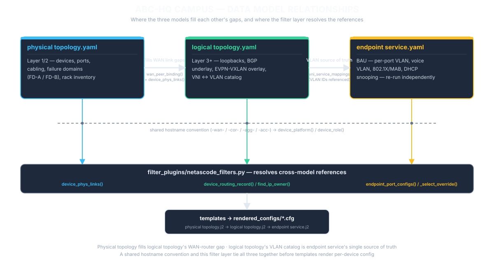

# Automation Native Network Design Explain

This is a sample enterprise network design to demonstrate how an automation native network design should look like. Automation native design approach incorporates the following elements required by network automation into the classic design process.

- **Determinsitic Topology**: One repeatable pattern, applied consistently everywhere it occurs
- **Abstraction**: Devices generalized into reusable roles, not configured one by one
- **Machine-Friendly interfaces & structured data**: Intent captured as schema-validated data, not prose or diagrams
- **Unique source of truth**: Each fact lives in exactly one place, never restated elsewhere.
- **Declarative state**: State the desired end result; automation works out the steps
- **Streaming Telemetry**: Live device state flows back continuously, not checked on demand

## Difference between traditional and automation native network design approach

Both approaches pass through the same stages — the difference is *how* each stage is done.

## Key takeaways:
- Data model first, design content generated from various data model.
- Generated contents includes diagrams, cable patching matrix, design specific templates, configurations, playbooks.
- Data model is constructed from various schema by merging the values obtained from source of truth (i.e Netbox). The integration of SOT is not shown in this example.
- Device configuration is render using jinja2 templates by looking up the data models. Ansible comes afterward to deploy.
- Design is validated by comparing the config output with the data model.
- To support BAU port changes, the data model need to be constantly updated to reflect the latest switch port configuration.
- Concept:
  - schema + value = data model
  - data model + template = rendered config
  - playbook + rendered config = deployed config
  - validation = data model vs deployed config

<div style="display: flex; gap: 20px;">
  <div style="flex: 1;">
    <h3>Automation Native Design Approach</h3>
  </div>

  <div style="flex: 1;">
    
  </div>
</div>

---

# Campus Network Design

## Business Requirement

Company ABC is setting up a new 2,000 user campus across a 10-floor building. At this scale, the business needs the network to onboard new starters, moves, and floor-capacity changes quickly without service risk; to keep voice, data, wireless, and fixed-function devices like cameras and IPTV appropriately segmented so a change in one domain can't degrade or expose another. The business also wants these changes itself to be fast, low-risk, and auditable — every BAU change traceable to a reviewed, versioned intent rather than an ad hoc CLI session.

The business requirements can be summarized as:
1. Onboard starters, moves, and floor-capacity changes quickly, without service risk
2. Segment voice/data/wireless/camera/IPTV so one domain can't degrade or expose another
3. BAU Change is fast, low-risk, and auditable

## Technical Requirement

| Business Requirements | Technical Requirements | 
|---|---|
| Onboard starters, moves, and floor-capacity changes quickly, without service risk | ​- A layer 3 Routed Access EVPN-VXLAN Fabric as underlay where Layer 2 / 3 services can be running on top <br> - ​Zero-Trust Access Ports (Identity-Driven Access) |
| Segment voice/data/wireless/camera/IPTV so one domain can't degrade or expose another | - ​Macro-Segmentation (VRF Isolation) to separate differnt business nature of devices into different tenants <br> - ​Micro-Segmentation & QoS Policies to restrict communication between devices within the same tenant |
| BAU Change is fast, low-risk, and auditable | ​- Single Source of Truth (SSoT) & Infrastructure-as-Code (IaC) <br> - ​CI/CD Pipeline with Automated Validation <br> - ​Streaming Telemetry & Closed-Loop Auditing |

## Scope

For the sake of demonstration, the implementation details of management and WIFI network are not covered.

## Network Design

This section outlines the architectural framework and design principles for the campus network:

### Topology & Connectivity Hierarchy

* Implements a standard five-tier architecture: Regional On-Prem/Cloud Colo Access $\rightarrow$ WAN $\rightarrow$ Core $\rightarrow$ Aggregation $\rightarrow$ Access.
* Extends dual-homed connections across all network tiers for end-to-end path redundancy.


### Control Plane & Overlay Architecture

* Deploys a unified BGP Routing-based transport underlay.
* Runs EVPN-VXLAN on top of the underlay to deliver flexible Layer 2/Layer 3 multi-tenant virtual overlay networks.
* Seats the L2VPN EVPN route reflector at the Core tier — each access-VTEP peers as a route-reflector-client to the two core routers in its own failure domain; the four RR cores full-mesh each other so routes reflected in one failure domain reach the other.


### Network Services & Security

* Mandates 802.1X Network Access Control (NAC) across all Access switch endpoint interfaces.
* Centralizes RADIUS authentication and authorization services within the hub data center.

### Platform Standardization

* WAN Tier: Standardized on a dedicated WAN routing platform optimized for edge peering and WAN features.
* Core & Aggregation Tiers: Standardized on a single, high-throughput campus fabric switching platform.
* Access Tier: Standardized on a dedicated edge-switching platform designed for high-density endpoint connectivity and 802.1X enforcement.

### Resiliency & Fault Isolation

* Enforces complete two-way physical and logical diversity across all infrastructure components (dual WAN routers, dual ISP/colo circuits).
* Extends two-way isolation into dedicated dual failure domains (FD-A and FD-B) spanning the Core, Aggregation, and Access layers.

### Bandwidth & Interface Capacity

* Endpoint Ports: Supports 1Gbps or 10Gbps access connectivity per endpoint interface.
* Inter-Device Trunking: All internal backbone, Core, Aggregation, and inter-plane links operate at 100Gbps.
* WAN Edge Uplinks: Dual 10Gbps dedicated circuits connecting the campus WAN edge to regional on-prem data centers and cloud colocation facilities.

## Data Models

This design is constructed from a set of data models which provides a structure for the "source of truth" information required by the design. The data model is embedded with the value so that it can be used by the automation to render, deploy and validate the configurations. Every data modelis governed by a JSON Schema under [`schemas/`](schemas/) 

### Design Driven Models

Design driven models are specific models created for this design. They defines the physical and logical network topology, as well as the endpoint service (i.e. interface configurations) required on the access switches.



[Physical Topology - Campus Network](models/physical%20topology.yaml) 

Purpose: Ground-truth inventory of campus network hardware and cabling — devices, ports, and interconnects

- Layer 1/2 only — devices and cabling, no IPs/routing
- Two failure domains (FD-A/FD-B), each a full WAN→Core→Agg stack, cross-connected for domain-level resilience
- Every access switch dual-homed to two different agg switches
- Cross-tier links declared once, reconciled by a filter function (not raw YAML)
- No LACP — each fabric link goes to a different neighbor, ECMP is the redundancy mechanism
- Platform/role derived from hostname, not stored as a field
- OOB management network modeled as a separate, parallel file
- Schema: [physical-topology.schema.json](schemas/physical-topology.schema.json)

[Logical Topology](models/logical%20topology.yaml)

Purpose: Defines the campus's BGP underlay and VXLAN EVPN overlay — how traffic is forwarded and isolated, independent of physical hardware

- Layer 3+ on top of the physical model — IP addressing, BGP, and EVPN-VXLAN overlay, no cabling/ports of its own
- Single AS (65100) for the whole campus — WAN, core, agg, access all iBGP; only the two ISP links are eBGP
- VNI-to-VLAN mapping table is the single source of truth (6 segments: Users, Cameras, Voice, AP-mgmt, IPTV, Critical-fallback) — referenced by endpoint service model
- Access switches are the EVPN VTEPs (Loopback0 mgmt + Loopback1 VTEP-source); core/agg are pure L3 underlay transit with no VTEP config
- WAN routers interface details are excluded — a filter script (wan_peer_binding) constructs their local port/IP by cross-referencing the physical model and peer IPs
- Two normalization filter scripts do the heavy lifting rendering: one merges wan/core/agg's routing block and access's evpn_vtep block into one common shape; another matches an IP to the device that owns it
- Core routers act as L2VPN EVPN route reflectors — a single evpn_route_reflector: true flag per core is all the model states; a filter script (evpn_rr_peers) derives the full peering scheme from that plus the existing failure_domain grouping (RR mesh between cores, route-reflector-client from each access-VTEP to its own FD's two cores)
- Schema: [logical-topology.schema.json](schemas/logical-topology.schema.json)

[Endpoint Service](models/endpoint%20service.yaml)

Purpose: Standardized security and QoS baseline for endpoint switchports — loop protection, 802.1X/MAB, FHS, and edge QoS

- Per-port switchport policy — VLAN, voice VLAN, security, QoS
- A default_profile applies across a whole range (GigabitEthernet1/0/1-48); port_overrides layer exceptions on top per-interface
- The model uses two different field names for the same access-VLAN concept (native_vlan in the default, access_vlan in overrides) — a filter script is used to reconcile them
- Each override carries a switch field: null/absent applies it to every access switch, a hostname scopes it to just one. This is to allow BAU change (via set_endpoint_port.py) target a single switch/port without touching the rest
- Work together with the acccess role model to produce the switch port configuration. Access role model supplies the switch-wide parameters. This model supply the per port policy.
- Security stack enabled on switch port: 802.1X + MAB, DHCP snooping, IP source guard, dynamic ARP inspection, BPDU guard/portfast
- Schema: [endpoint-service.schema.json](schemas/endpoint-service.schema.json)

[Telemery](models/telemetry.yaml)

Purpose: Model-driven telemetry (MDT) subscriptions — what each device streams, to which collector, and how often

- Three catalogs: telemetry_destinations (collector), sensor_groups (sensor paths + sample interval), role_subscriptions (per-role assignment referencing the other two by name)
- A filter (device_telemetry_subscription()) resolves device_role() → role_subscriptions entry → expands the destination and sensor-group names into full data before the template consume it
- This is the read path back from devices, closing the loop the other three models only open (they declare intent and get pushed; this one reports what's actually happening)
- Schema: [telemetry.schema.json](schemas/telemetry.schema.json)

### Device Role Models

A role is the function of the device performed in the design. This design will utilize 3 role models from an existing product catalog. 

[WAN Edge Role](models/wan%20edge%20role.yaml)

- Applying Platform: Catalyst 8000
- Jinja2 template: [Catalyst 8000.j2](templates/catalyst%208000.j2)
- Schema: [wan-edge-role.schema.json](schemas/wan-edge-role.schema.json)

[Core & Agg Role](models/core%20agg%20role.yaml) 

- Applying Platform Platform: Nexus 93240
- Jinja2 template: [Nexus 93240 j2](templates/nexus%2093240.j2)
- Schema: [core-agg-role.schema.json](schemas/core-agg-role.schema.json)

[Access Role](models/access%20role.yaml) 

- Applying Platform: Catalyst 9000
- Jinja2 template: [Catalyst 9000.j2](templates/catalyst%209000.j2)
- Schema: [access-role.schema.json](schemas/access-role.schema.json)

## Design Validation

The design has gone through data modeling, templating, rendering and deployment stages. It is important to ensure the outcome configuration matchs with the data model. A validation is added to pick up issues during templating, rendering or even deployment. This is done using the [validation playbook](ansible_resources/playbooks/00_validate_render.yml). 

The script will produce the [validation report](validation_report.md)
## Design Deployment (a.k.a Low Level Design)

Prerequisite:
- Management Network has been up and running so that devices are reachable by Ansible runners
- Devices are physically racked and patched according to the patching scheme

### Step 1. Populate the schema in the network source of truth platform (Already done)

### Step 2. Ingest value into the schema to generate data models (Already done)

### Step 3. Setup management connectivity to device

* Submit [patching record](Rack_Patching_Record.md) to facility team for physical setup
* Login to the device and manually configure IP address and gateway for management interface) (Assume management network has been setup)

### Step 4. Make sure the templates and playbooks are loaded onto the Ansible runners hosts

### Step 5. Execute the [Site build master playbook](ansible_resources/playbooks/site.yml) which will execute the corresponding playbooks in sequence:

* [Baseline build](ansible_resources/playbooks/01_baseline_build.yml)
* [Physical topology build](ansible_resources/playbooks/02_physical_topology.yml)
* [Logical topology build](ansible_resources/playbooks/03_logical_topology.yml)
* [Telemetry build](ansible_resources/playbooks/04_streaming_telemetry.yml)

```yaml
ansible-playbook playbooks/site.yml                  # validates, then pushes config to real devices
ansible-playbook playbooks/site.yml -e deploy=false   # validates, renders every stage, saves output, touches no device
```

### Step 6. Execute [service deployment playbook](ansible_resources/playbooks/bau_endpoint_provisioning.yml) to provision the interface on the access switch.

```yaml
ansible-playbook playbooks/bau_endpoint_provisioning.yml \
    -e switch_name=abc-hq-f01-acc-01 -e interface_name=GigabitEthernet1/0/5 \
    -e vlan=20 -e voice_vlan=30 -e description="Marketing desk move, INC0012345"
```

## Config Output
Here is the rendered configurations of a devices, other device's configuration can be found under [config](/config)
```
! ============================================================
! abc-hq-wan-01  (platform: catalyst8000, role: wan-edge)
! Rendered: baseline -> physical topology -> logical topology -> telemetry
! ============================================================

! ---------- 1. Platform baseline (catalyst 8000.j2 + wan edge role.yaml) ----------
!
banner login ^C
Authorized Use Only. System activity is logged.
^C
!
ip domain name campus.example.net
ip domain lookup source-interface Loopback0
!
ip ssh version 2
!
line con 0
 exec-timeout 10 0
 login local
!
line vty 0 15
 exec-timeout 15 0
 transport input ssh
 login local
!
aaa local authentication attempts max-fail 3
!
no ip http server
no ip http secure-server
!
ntp server 10.254.1.10
ntp server 10.254.1.11
ntp source Loopback0
!
logging host 10.254.1.30
logging host 10.254.1.31
logging source-interface Loopback0
logging trap informational
!
snmp-server community CAMPUS-MONITORING-RO RO
snmp-server contact netops@campus.example.net
snmp-server location abc-hq
snmp-server host 10.254.1.20 traps
!
tacacs server TACACS-1
 address ipv4 10.254.1.40
 key DEMO-TACACS-KEY-CHANGE-ME
tacacs server TACACS-2
 address ipv4 10.254.1.41
 key DEMO-TACACS-KEY-CHANGE-ME
ip tacacs source-interface Loopback0
aaa group server tacacs+ TACACS-GROUP
 server name TACACS-1
 server name TACACS-2
aaa authentication login default group TACACS-GROUP local
aaa authorization exec default group TACACS-GROUP local
!
no ip source-route
ip icmp rate-limit unreachable 100
!
! NOTE: the remaining infrastructure_protection settings (accept_redirects,
! proxy_arp, mask_requests) and ipv6_hardening.ra_suppress are applied
! per-interface (no ip redirects / no ip proxy-arp / no ip mask-reply /
! ipv6 nd ra suppress all) -- deferred to the interface-stage template,
! since there are no interfaces to attach them to yet.
!
ip access-list extended fw-in-wan-interface-acl
 remark TODO: define real permit/deny entries for the WAN-facing ACL -- not present in the data model
 remark Placeholder only -- do not deploy as-is
 deny   ip any any log
!
! NOTE: this ACL is defined here as a baseline object but not yet applied to
! an interface (ip access-group fw-in-wan-interface-acl in) -- that
! application, and wan_interfaces.passive_routing_interface, happen at the
! interface stage.
!
ip access-list extended COPP-ACL-ROUTING_UPDATES
 remark BGP control-plane sessions -- the only routing protocol anywhere in
 remark this design's data model (logical_topology.yaml has no OSPF/EIGRP
 remark session defined); extend this ACL if another IGP is ever added.
 permit tcp any eq bgp any
 permit tcp any any eq bgp
!
ip access-list extended COPP-ACL-MANAGEMENT_ACCESS
 remark Device management-plane access -- only matches protocols THIS
 remark device's own management_plane settings actually enable (SSH is
 remark unconditional; SNMP/NTP/TACACS+ only when enabled/non-empty),
 remark same "don't render disabled things" rule the rest of this
 remark template already follows.
 permit tcp any any eq 22
 permit udp any any eq snmp
 permit udp any any eq snmptrap
 permit udp any any eq ntp
 permit tcp any any eq tacacs
!
ip access-list extended COPP-ACL-TRANSIT_TRAFFIC
 remark ICMP hardware-forwarding-exception traffic (unreachables/TTL-exceeded
 remark generation -- icmp_standards.unreachable_rate_limit is always set in
 remark this baseline). ARP is matched separately below via "match protocol
 remark arp" since ARP isn't an IP protocol an ACL can match. This is a
 remark standard CoPP classification pairing, not a value logical_topology.
 remark yaml / platform_wan_baseline.yaml specifies.
 permit icmp any any
!
class-map match-any COPP-ROUTING_UPDATES
 match access-group name COPP-ACL-ROUTING_UPDATES
!
class-map match-any COPP-MANAGEMENT_ACCESS
 match access-group name COPP-ACL-MANAGEMENT_ACCESS
!
class-map match-any COPP-TRANSIT_TRAFFIC
 match access-group name COPP-ACL-TRANSIT_TRAFFIC
 match protocol arp
!
policy-map CONTROL-PLANE-POLICY
 class COPP-ROUTING_UPDATES
  police 32000 conform-action transmit exceed-action drop
  ! priority tier from platform_wan_baseline: "medium" -- rate above is a starting-point placeholder, tune per site
 class COPP-MANAGEMENT_ACCESS
  police 8000 conform-action transmit exceed-action drop
  ! priority tier from platform_wan_baseline: "low" -- rate above is a starting-point placeholder, tune per site
 class COPP-TRANSIT_TRAFFIC
  police 128000 conform-action transmit exceed-action drop
  ! priority tier from platform_wan_baseline: "high" -- rate above is a starting-point placeholder, tune per site
!
control-plane
 service-policy input CONTROL-PLANE-POLICY
!
! NOTE: bgp_security (md5_authentication: True,
! ttl_security_hops: 2) is a per-neighbor
! setting applied under "router bgp <asn>" once the ASN and neighbor list are
! known from logical_topology.yaml -- deferred to that stage. Still flagged
! from the earlier review: confirm ttl_security_hops (physical_topology.yaml
! shows a single-hop ISP circuit, which would argue for 1, not 2) and confirm
! whether wan_interfaces.passive_routing_interface is meant to apply anywhere,
! since BGP has no native passive-interface concept.
!
! NOTE: secure_boot_verification -- Secure Boot on Catalyst 8000 is a
! hardware-anchored (SUDI-based) feature verified automatically at boot;
! there is no standard IOS-XE enable/disable command for it, so no CLI is
! emitted here. Confirm via 'show platform sudi certificate' post-deploy.
! NOTE: hardware_crypto_acceleration -- hardware crypto engine use on
! Catalyst 8000 is governed by the installed throughput/security license
! and platform hardware, not a single confirmed IOS-XE CLI toggle. Verify
! via 'show platform hardware qfp active feature crypto' post-deploy
! rather than assuming a command exists here.
!
end
! ---------- 2. Physical topology (physical topology.j2) ----------
!
hostname abc-hq-wan-01
!
interface TenGigabitEthernet0/0/0
 description EXTERNAL - Service Provider A 10Gbps Ethernet Line (wan_circuit)
 no shutdown
!
interface HundredGigE0/1/0
 description FABRIC - to abc-hq-wan-02 HundredGigE0/1/0 (inter_device)
 no shutdown
!
interface HundredGigE0/2/0
 description FABRIC - to abc-hq-cor-01 HundredGigE0/0/1 (inter_device)
 no shutdown
!
interface HundredGigE0/2/1
 description FABRIC - to abc-hq-cor-03 HundredGigE0/0/1 (inter_device)
 no shutdown
!
! NOTE: abc-hq-wan-01's internal_links in physical_topology.yaml include
! a link to its WAN-tier peer (the horizontal wan-01<->wan-02 interconnect)
! that has no corresponding entry anywhere in logical_topology.yaml's
! bgp_peers for this device -- that physical link is brought up above but
! carries no routing session. Confirm whether it's meant to (e.g. a direct
! iBGP/heartbeat path between the two WAN edges) or is deliberately
! data-plane-only / unused at this stage.
!
end
! ---------- 3. Logical topology (logical topology.j2) ----------
!
interface Loopback0
 ip address 10.0.0.1 255.255.255.255
 description LOOPBACK - management
 no shutdown
!
! NOTE: TenGigabitEthernet0/0/0 carries "eBGP to ISP-A" (peer 192.168.10.1)
! but no local IP can be derived for it -- eBGP peers have no counterpart
! `interfaces:` entry on either side of logical_topology.yaml to derive an
! address from (see FINDING 1). Address must be supplied before deploying.
interface HundredGigE0/2/0
 ip address 10.18.1.0 255.255.255.254
 description UNDERLAY - iBGP to core-01 (FD-A)
!
interface HundredGigE0/2/1
 ip address 10.18.1.2 255.255.255.254
 description UNDERLAY - iBGP Cross-FD to core-03
!
router bgp 65100
 bgp router-id 10.0.0.1
 bgp log-neighbor-changes
 neighbor 192.168.10.1 remote-as 65530
 neighbor 192.168.10.1 description eBGP to ISP-A
 neighbor 192.168.10.1 ttl-security hops 2
 neighbor 192.168.10.1 password !! VAULT-REFERENCE-REQUIRED !!
 neighbor 10.18.1.1 remote-as 65100
 neighbor 10.18.1.1 description iBGP to core-01 (FD-A)
 neighbor 10.18.1.1 ttl-security hops 2
 neighbor 10.18.1.1 password !! VAULT-REFERENCE-REQUIRED !!
 neighbor 10.18.1.3 remote-as 65100
 neighbor 10.18.1.3 description iBGP Cross-FD to core-03
 neighbor 10.18.1.3 ttl-security hops 2
 neighbor 10.18.1.3 password !! VAULT-REFERENCE-REQUIRED !!
 address-family ipv4 unicast
  neighbor 192.168.10.1 activate
  neighbor 10.18.1.1 activate
  neighbor 10.18.1.3 activate
 exit-address-family
!
end
! ---------- 4. Streaming telemetry (telemetry.j2) ----------
!
telemetry ietf subscription 101
 encoding gpb_kv
 filter xpath Cisco-NX-OS-device:System/intf-items
 stream yang-push
 update-policy periodic 3000
 receiver ip address 10.254.1.50 port 57500 protocol grpc-tcp
!
telemetry ietf subscription 102
 encoding gpb_kv
 filter xpath Cisco-NX-OS-device:System/proc-items
 filter xpath Cisco-NX-OS-device:System/eqptmgr-items
 stream yang-push
 update-policy periodic 6000
 receiver ip address 10.254.1.50 port 57500 protocol grpc-tcp
!
! NOTE: update-policy periodic is in centiseconds (1/100s) on IOS-XE MDT,
! not milliseconds -- the value above is telemetry.yaml's
! sample_interval_ms divided by 10. filter xpath values are placeholders
! (see the FINDING above) -- this device's role needs the equivalent
! Cisco-IOS-XE-*-oper YANG xpath before this subscription will actually
! stream anything meaningful; not silently substituted here.
!
end
```
</details>
